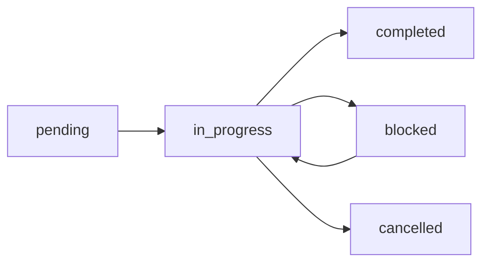

# Task Management System

## Overview
This directory contains the formal task tracking system for the Ticketz project. All tasks are stored in JSONL (JSON Lines) format for efficient streaming and append-only operations.

## Directory Structure
```
.claude/tasks/
├── README.md                 # This file - workflow documentation
├── TASK_TEMPLATE.json       # Template for creating new tasks
├── active-tasks.jsonl       # Currently active tasks
├── sprint-2025-01.jsonl     # Current sprint backlog
├── completed/               # Archive of completed tasks (by month)
└── blocked/                 # Tasks currently blocked
```

## Task Lifecycle

### 1. Task Creation
Tasks are created by the Project Manager or any agent identifying work:
- Use `TASK_TEMPLATE.json` as a starting point
- Assign unique ID following pattern: `TASK-XXX`
- Add to `active-tasks.jsonl` as new line
- Include in current sprint if applicable

### 2. Task States


- **pending**: Task created but not started
- **in_progress**: Actively being worked on
- **completed**: Task successfully finished
- **blocked**: Waiting on dependency or external factor
- **cancelled**: Task no longer needed

### 3. Task Assignment
Tasks are assigned to specialized agents:
- **frontend-engineer**: UI/UX development tasks
- **backend-engineer**: API and server-side tasks
- **qa-engineer**: Testing and quality assurance
- **devops-engineer**: Infrastructure and deployment
- **project-manager**: Planning and coordination
- **scrum-master**: Process and conflict resolution

### 4. Task Updates
When updating task status:
1. Append new entry to `active-tasks.jsonl` with updated status
2. Update `updated_at` timestamp
3. Add comment if significant change
4. Update sprint velocity if in current sprint

## File Formats

### active-tasks.jsonl
Each line is a complete JSON object representing a task or task update:
```json
{"id":"TASK-001","type":"feature","title":"Task Title","status":"pending",...}
```

### sprint-YYYY-MM.jsonl
Sprint file contains:
- Sprint metadata (first line)
- Task assignments to sprint
- Velocity tracking updates

## Task Queries

### Find all pending tasks
```bash
grep '"status":"pending"' active-tasks.jsonl | tail -1
```

### Find tasks by assignee
```bash
grep '"assigned_to":"frontend-engineer"' active-tasks.jsonl
```

### Get current sprint velocity
```bash
grep '"type":"sprint_velocity"' sprint-2025-01.jsonl | tail -1
```

## Integration with Agents

### Agent Responsibilities

1. **Project Manager**
   - Creates and prioritizes tasks
   - Assigns tasks to appropriate agents
   - Monitors overall progress
   - Updates sprint velocity

2. **Specialized Agents**
   - Check for assigned tasks
   - Update task status when starting work
   - Add comments for significant updates
   - Mark tasks complete with notes

3. **Scrum Master**
   - Reviews blocked tasks
   - Facilitates dependency resolution
   - Archives completed sprints

## Task Priorities

- **CRITICAL**: Must be done immediately, blocks other work
- **HIGH**: Should be done this sprint
- **MEDIUM**: Important but not urgent
- **LOW**: Nice to have, can be deferred

## Acceptance Criteria
Every task must have clear, measurable acceptance criteria:
- Specific outcomes that can be verified
- Technical requirements met
- Tests passing
- Documentation complete

## Dependencies
Tasks can have dependencies:
- `depends_on`: Tasks that must complete first
- `blocks`: Tasks that cannot start until this completes

## Story Points
Used for velocity tracking:
- 1-2 points: Simple task (< 2 hours)
- 3-5 points: Medium task (2-4 hours)
- 8 points: Complex task (1 day)
- 13+ points: Should be broken down

## Archival Process
At sprint end:
1. Move completed tasks to `completed/YYYY-MM.jsonl`
2. Archive sprint file to `sprints/archive/`
3. Generate sprint retrospective report
4. Create new sprint file

## Reporting

### Daily Standup Format
Each agent reports:
- Yesterday: Completed task IDs
- Today: In-progress task IDs
- Blockers: Any blocked tasks

### Sprint Metrics
- Velocity: Story points completed
- Burndown: Points remaining over time
- Cycle time: Average time from start to complete
- Blocked time: Time tasks spend blocked

## Best Practices

1. **One task in progress**: Agents should have only one in-progress task
2. **Update immediately**: Status changes should be recorded in real-time
3. **Comment on blocks**: Always explain why a task is blocked
4. **Link related tasks**: Use dependencies to show relationships
5. **Regular cleanup**: Archive completed tasks monthly

## Automation Hooks

Tasks can trigger automated actions:
- Status change to `in_progress` → Start time tracking
- Status change to `completed` → Run tests
- Priority set to `CRITICAL` → Notify team
- Task blocked → Alert Project Manager

## Emergency Procedures

### Critical Bug Found
1. Create task with priority `CRITICAL`
2. Assign to appropriate engineer
3. Add `hotfix` tag
4. Link to bug report

### Sprint at Risk
1. Project Manager reviews all tasks
2. Re-prioritize based on MVP requirements
3. Move lower priority to backlog
4. Update sprint goals

## Task Templates by Type

### Feature Task
```json
{
  "type": "feature",
  "acceptance_criteria": ["User can...", "System validates...", "UI displays..."]
}
```

### Bug Fix Task
```json
{
  "type": "bug",
  "technical_notes": {
    "reproduction_steps": ["Step 1", "Step 2"],
    "expected_behavior": "...",
    "actual_behavior": "..."
  }
}
```

### Infrastructure Task
```json
{
  "type": "infrastructure",
  "technical_notes": {
    "systems_affected": ["..."],
    "downtime_required": false,
    "rollback_plan": "..."
  }
}
```

## Contact

- **Task System Owner**: Project Manager Agent
- **Technical Issues**: DevOps Engineer Agent
- **Process Questions**: Scrum Master Agent

---

*Last Updated: 2025-01-10*
*Version: 1.0.0*