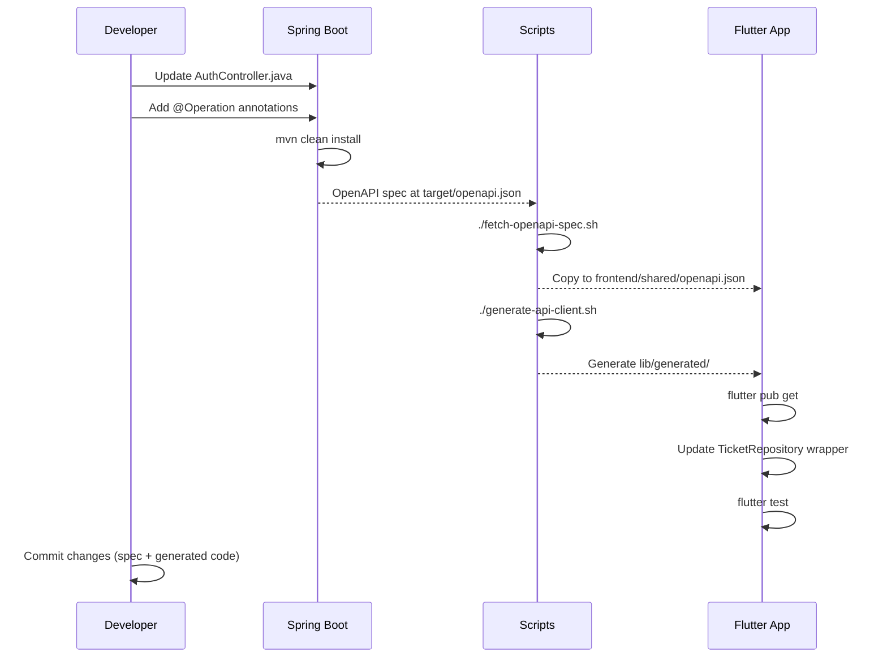

# API Client Generation for The Chain

**Version:** 1.0
**Date:** October 9, 2025
**Status:** Strategic Planning Document
**Owner:** API Integration Team

---

## Executive Summary

This document outlines the strategy for auto-generating API clients from OpenAPI specifications, ensuring type-safe, consistent communication between Flutter apps and the Spring Boot backend.

### Benefits of API Client Generation

| Benefit | Impact |
|---------|--------|
| **Type Safety** | Compile-time errors instead of runtime crashes |
| **Consistency** | Single source of truth (OpenAPI spec) |
| **Developer Productivity** | No manual API client coding |
| **Documentation** | API docs generated alongside code |
| **Versioning** | Track API changes via spec diffs |
| **Testing** | Mock servers from spec for testing |

---

## Table of Contents

1. [OpenAPI Specification](#openapi-specification)
2. [Code Generation Tools](#code-generation-tools)
3. [Integration with Backend](#integration-with-backend)
4. [Integration with Flutter](#integration-with-flutter)
5. [Workflow & Automation](#workflow--automation)
6. [Customization & Extensions](#customization--extensions)

---

## OpenAPI Specification

### What is OpenAPI?

OpenAPI (formerly Swagger) is a standard for describing REST APIs. It defines:
- **Endpoints:** `/api/v1/tickets/generate`
- **Request/Response Models:** JSON schemas
- **Authentication:** Bearer tokens, API keys
- **Error Responses:** HTTP status codes, error formats

---

### OpenAPI 3.0 Spec Structure

**backend/src/main/resources/openapi.yaml**
```yaml
openapi: 3.0.3
info:
  title: The Chain API
  version: 1.0.0
  description: Social ticketing chain network API
  contact:
    email: support@thechain.app

servers:
  - url: http://localhost:8080/api/v1
    description: Development server
  - url: https://api-staging.thechain.app/api/v1
    description: Staging server
  - url: https://api.thechain.app/api/v1
    description: Production server

components:
  securitySchemes:
    bearerAuth:
      type: http
      scheme: bearer
      bearerFormat: JWT

  schemas:
    User:
      type: object
      required:
        - id
        - chainKey
        - position
        - displayName
      properties:
        id:
          type: string
          format: uuid
          example: "550e8400-e29b-41d4-a716-446655440000"
        chainKey:
          type: string
          example: "CHAIN_001"
        position:
          type: integer
          example: 42
        displayName:
          type: string
          minLength: 3
          maxLength: 50
          example: "Alice"
        email:
          type: string
          format: email
          example: "alice@example.com"
        wastedTicketsCount:
          type: integer
          minimum: 0
          example: 2
        createdAt:
          type: string
          format: date-time
          example: "2025-10-08T12:34:56Z"

    Ticket:
      type: object
      required:
        - id
        - ownerId
        - issuedAt
        - expiresAt
        - status
      properties:
        id:
          type: string
          format: uuid
        ownerId:
          type: string
          format: uuid
        ticketCode:
          type: string
          pattern: '^[A-Z0-9]{6}$'
          example: "ABC123"
        qrPayload:
          type: string
          description: Base64-encoded signed ticket data
        issuedAt:
          type: string
          format: date-time
        expiresAt:
          type: string
          format: date-time
        status:
          type: string
          enum: [ACTIVE, USED, EXPIRED, CANCELLED]

    AuthResponse:
      type: object
      properties:
        userId:
          type: string
          format: uuid
        chainKey:
          type: string
        displayName:
          type: string
        position:
          type: integer
        tokens:
          type: object
          properties:
            accessToken:
              type: string
            refreshToken:
              type: string
            expiresIn:
              type: integer
              description: Token expiration in seconds

    ErrorResponse:
      type: object
      properties:
        error:
          type: object
          properties:
            code:
              type: string
              example: "TICKET_EXPIRED"
            message:
              type: string
              example: "The ticket has expired"
            timestamp:
              type: string
              format: date-time

paths:
  /auth/login:
    post:
      summary: Login user
      tags: [Authentication]
      requestBody:
        required: true
        content:
          application/json:
            schema:
              type: object
              required: [username, password]
              properties:
                username:
                  type: string
                password:
                  type: string
                  format: password
      responses:
        '200':
          description: Login successful
          content:
            application/json:
              schema:
                $ref: '#/components/schemas/AuthResponse'
        '401':
          description: Invalid credentials
          content:
            application/json:
              schema:
                $ref: '#/components/schemas/ErrorResponse'

  /tickets/generate:
    post:
      summary: Generate new ticket
      tags: [Tickets]
      security:
        - bearerAuth: []
      requestBody:
        content:
          application/json:
            schema:
              type: object
              properties:
                message:
                  type: string
                  maxLength: 100
      responses:
        '201':
          description: Ticket generated
          content:
            application/json:
              schema:
                $ref: '#/components/schemas/Ticket'
        '409':
          description: User already has active ticket
          content:
            application/json:
              schema:
                $ref: '#/components/schemas/ErrorResponse'

  /tickets/my:
    get:
      summary: Get current user's tickets
      tags: [Tickets]
      security:
        - bearerAuth: []
      responses:
        '200':
          description: List of tickets
          content:
            application/json:
              schema:
                type: array
                items:
                  $ref: '#/components/schemas/Ticket'

  /users/me:
    get:
      summary: Get current user profile
      tags: [Users]
      security:
        - bearerAuth: []
      responses:
        '200':
          description: User profile
          content:
            application/json:
              schema:
                $ref: '#/components/schemas/User'

  /chain/stats:
    get:
      summary: Get chain statistics
      tags: [Chain]
      responses:
        '200':
          description: Chain statistics
          content:
            application/json:
              schema:
                type: object
                properties:
                  totalUsers:
                    type: integer
                  activeTickets:
                    type: integer
                  wasteRate:
                    type: number
                    format: float
```

---

## Code Generation Tools

### Backend: SpringDoc OpenAPI

**Goal:** Auto-generate OpenAPI spec from Spring Boot controllers

#### 1. Add Dependency

**pom.xml:**
```xml
<dependency>
    <groupId>org.springdoc</groupId>
    <artifactId>springdoc-openapi-starter-webmvc-ui</artifactId>
    <version>2.2.0</version>
</dependency>
```

#### 2. Configure

**application.yml:**
```yaml
springdoc:
  api-docs:
    path: /api/v1/api-docs
  swagger-ui:
    path: /api/v1/swagger-ui.html
    operationsSorter: method
  packages-to-scan: com.thechain.controller
```

#### 3. Annotate Controllers

**AuthController.java:**
```java
@RestController
@RequestMapping("/auth")
@Tag(name = "Authentication", description = "User authentication endpoints")
public class AuthController {

    @Operation(
        summary = "Login user",
        description = "Authenticate user with username and password"
    )
    @ApiResponses(value = {
        @ApiResponse(
            responseCode = "200",
            description = "Login successful",
            content = @Content(schema = @Schema(implementation = AuthResponse.class))
        ),
        @ApiResponse(
            responseCode = "401",
            description = "Invalid credentials",
            content = @Content(schema = @Schema(implementation = ErrorResponse.class))
        )
    })
    @PostMapping("/login")
    public ResponseEntity<AuthResponse> login(
        @Valid @RequestBody LoginRequest request
    ) {
        // ...
    }
}
```

#### 4. Access Generated Spec

**OpenAPI JSON:**
```
http://localhost:8080/api/v1/api-docs
```

**Swagger UI (Interactive Docs):**
```
http://localhost:8080/api/v1/swagger-ui.html
```

---

### Frontend: OpenAPI Generator

**Goal:** Generate Dart API client from OpenAPI spec

#### 1. Install OpenAPI Generator

**Using Docker (recommended):**
```bash
docker pull openapitools/openapi-generator-cli:latest
```

**Using npm:**
```bash
npm install -g @openapitools/openapi-generator-cli
```

---

#### 2. Download OpenAPI Spec

**scripts/fetch-openapi-spec.sh:**
```bash
#!/bin/bash
set -e

# Fetch OpenAPI spec from running backend
curl http://localhost:8080/api/v1/api-docs > frontend/shared/openapi.json

echo "✅ OpenAPI spec downloaded to frontend/shared/openapi.json"
```

---

#### 3. Generate Dart Client

**scripts/generate-api-client.sh:**
```bash
#!/bin/bash
set -e

SPEC_FILE="frontend/shared/openapi.json"
OUTPUT_DIR="frontend/shared/lib/generated"

# Remove old generated code
rm -rf $OUTPUT_DIR

# Generate Dart client
docker run --rm \
  -v "${PWD}:/local" \
  openapitools/openapi-generator-cli generate \
  -i /local/$SPEC_FILE \
  -g dart-dio \
  -o /local/$OUTPUT_DIR \
  --additional-properties=\
pubName=thechain_api,\
pubVersion=1.0.0,\
pubDescription="Auto-generated API client for The Chain"

# Format generated code
cd frontend/shared
flutter format lib/generated

echo "✅ API client generated in $OUTPUT_DIR"
```

---

#### 4. Generated Code Structure

```
frontend/shared/lib/generated/
├── lib/
│   ├── api/
│   │   ├── authentication_api.dart
│   │   ├── tickets_api.dart
│   │   ├── users_api.dart
│   │   └── chain_api.dart
│   ├── model/
│   │   ├── user.dart
│   │   ├── ticket.dart
│   │   ├── auth_response.dart
│   │   └── error_response.dart
│   └── api_client.dart
├── doc/
│   ├── AuthenticationApi.md
│   ├── TicketsApi.md
│   └── User.md
├── test/
│   └── (generated tests)
├── pubspec.yaml
└── README.md
```

---

#### 5. Use Generated Client

**Example:**
```dart
import 'package:thechain_shared/generated/lib/api.dart';

void main() async {
  // Initialize API client
  final apiClient = ApiClient(basePath: 'http://localhost:8080/api/v1');
  final authApi = AuthenticationApi(apiClient);

  // Login
  final loginRequest = LoginRequest(
    username: 'alice',
    password: 'password123',
  );

  try {
    final authResponse = await authApi.login(loginRequest);
    print('Access token: ${authResponse.tokens.accessToken}');

    // Configure bearer token for authenticated requests
    apiClient.addDefaultHeader('Authorization', 'Bearer ${authResponse.tokens.accessToken}');

    // Generate ticket
    final ticketsApi = TicketsApi(apiClient);
    final ticket = await ticketsApi.generateTicket(
      TicketRequest(message: 'Join my chain!'),
    );

    print('Ticket generated: ${ticket.ticketCode}');
  } on ApiException catch (e) {
    print('API error: ${e.message}');
  }
}
```

---

## Integration with Backend

### Automated Spec Generation

**Maven Plugin (Alternative to SpringDoc):**

**pom.xml:**
```xml
<plugin>
    <groupId>org.springdoc</groupId>
    <artifactId>springdoc-openapi-maven-plugin</artifactId>
    <version>1.4</version>
    <executions>
        <execution>
            <id>generate-openapi-spec</id>
            <phase>integration-test</phase>
            <goals>
                <goal>generate</goal>
            </goals>
        </execution>
    </executions>
    <configuration>
        <apiDocsUrl>http://localhost:8080/api/v1/api-docs</apiDocsUrl>
        <outputFileName>openapi.json</outputFileName>
        <outputDir>${project.build.directory}</outputDir>
    </configuration>
</plugin>
```

**Generate during build:**
```bash
mvn clean install
# OpenAPI spec generated at: target/openapi.json
```

---

### Validation: Spectral

**Goal:** Lint OpenAPI spec for best practices

**Install:**
```bash
npm install -g @stoplight/spectral-cli
```

**Create ruleset (.spectral.yaml):**
```yaml
extends: spectral:oas
rules:
  operation-description: error
  operation-tags: error
  operation-operationId: error
  info-contact: error
  info-description: error
  no-$ref-siblings: error
```

**Run:**
```bash
spectral lint backend/target/openapi.json
```

**Example output:**
```
  1:1  error  info-contact  Info object must have a contact object
  45:3 error  operation-description  Operation must have a description
```

---

## Integration with Flutter

### Custom Wrapper for Generated Client

**Problem:** Generated client is low-level, needs wrapping for:
- Token refresh logic
- Error handling
- Retry logic
- Offline support

**Solution:** Wrapper repository pattern

**lib/repositories/ticket_repository.dart:**
```dart
import 'package:thechain_shared/generated/lib/api.dart';
import '../database/daos/ticket_dao.dart';

class TicketRepository {
  final TicketsApi _ticketsApi;
  final TicketDao _ticketDao;

  TicketRepository(this._ticketsApi, this._ticketDao);

  Future<Ticket> generateTicket({String? message}) async {
    try {
      // Call generated API
      final generatedTicket = await _ticketsApi.generateTicket(
        TicketRequest(message: message),
      );

      // Convert generated model to app model
      final ticket = _convertToAppModel(generatedTicket);

      // Save to local database
      await _ticketDao.insertTicket(ticket);

      return ticket;
    } on ApiException catch (e) {
      if (e.code == 409) {
        throw TicketAlreadyExistsException();
      }
      rethrow;
    }
  }

  Ticket _convertToAppModel(GeneratedTicket generated) {
    return Ticket(
      id: generated.id!,
      ownerId: generated.ownerId!,
      ticketCode: generated.ticketCode,
      qrPayload: generated.qrPayload,
      issuedAt: DateTime.parse(generated.issuedAt!),
      expiresAt: DateTime.parse(generated.expiresAt!),
      status: _convertStatus(generated.status!),
    );
  }

  TicketStatus _convertStatus(String status) {
    switch (status) {
      case 'ACTIVE':
        return TicketStatus.active;
      case 'USED':
        return TicketStatus.used;
      case 'EXPIRED':
        return TicketStatus.expired;
      default:
        throw UnknownStatusException(status);
    }
  }
}
```

---

### Dependency Injection (Riverpod)

**lib/providers/api_providers.dart:**
```dart
import 'package:flutter_riverpod/flutter_riverpod.dart';
import 'package:thechain_shared/generated/lib/api.dart';

// Provider for base API client
final apiClientProvider = Provider<ApiClient>((ref) {
  return ApiClient(basePath: 'http://localhost:8080/api/v1');
});

// Provider for TicketsApi
final ticketsApiProvider = Provider<TicketsApi>((ref) {
  return TicketsApi(ref.read(apiClientProvider));
});

// Provider for TicketRepository (wrapper)
final ticketRepositoryProvider = Provider<TicketRepository>((ref) {
  return TicketRepository(
    ref.read(ticketsApiProvider),
    ref.read(ticketDaoProvider),
  );
});
```

---

## Workflow & Automation

### Development Workflow



---

### Automation: Pre-commit Hook

**Goal:** Regenerate client if backend changes

**.git/hooks/pre-commit:**
```bash
#!/bin/bash
set -e

# Check if backend controllers changed
if git diff --cached --name-only | grep -q "backend/src/main/java/com/thechain/controller"; then
  echo "Backend controllers changed, regenerating API client..."

  # Start backend (if not running)
  ./scripts/start-backend.sh

  # Fetch latest OpenAPI spec
  ./scripts/fetch-openapi-spec.sh

  # Regenerate client
  ./scripts/generate-api-client.sh

  # Add generated files to commit
  git add frontend/shared/lib/generated/

  echo "✅ API client regenerated"
fi
```

---

### CI/CD Integration

**GitHub Actions (.github/workflows/api-client-gen.yml):**
```yaml
name: Regenerate API Client

on:
  push:
    paths:
      - 'backend/src/main/java/com/thechain/controller/**'

jobs:
  regenerate-client:
    runs-on: ubuntu-latest
    steps:
      - uses: actions/checkout@v3

      - name: Set up JDK 17
        uses: actions/setup-java@v3
        with:
          distribution: 'temurin'
          java-version: '17'

      - name: Build backend
        run: |
          cd backend
          mvn clean install -DskipTests

      - name: Start backend
        run: |
          java -jar backend/target/chain-backend.jar &
          sleep 30  # Wait for startup

      - name: Fetch OpenAPI spec
        run: ./scripts/fetch-openapi-spec.sh

      - name: Generate API client
        run: ./scripts/generate-api-client.sh

      - name: Commit changes
        run: |
          git config user.name "GitHub Actions"
          git config user.email "actions@github.com"
          git add frontend/shared/lib/generated/
          git commit -m "chore: regenerate API client" || echo "No changes"
          git push
```

---

## Customization & Extensions

### Custom Templates (Advanced)

**Problem:** Generated code doesn't match project style

**Solution:** Use custom Mustache templates

**1. Extract default templates:**
```bash
docker run --rm \
  openapitools/openapi-generator-cli author template \
  -g dart-dio \
  -o /local/templates
```

**2. Customize templates:**

**templates/api.mustache:**
```mustache
// Custom header
// Generated by OpenAPI Generator for The Chain
// Do not edit manually

import 'package:dio/dio.dart';
import '../model/models.dart';

class {{classname}} {
  final Dio _dio;

  {{classname}}(this._dio);

  {{#operations}}
  {{#operation}}
  Future<{{#returnType}}{{{returnType}}}{{/returnType}}> {{operationId}}(
    {{#allParams}}
    {{{dataType}}} {{paramName}},
    {{/allParams}}
  ) async {
    // Custom implementation with logging
    print('[API] Calling {{operationId}}...');

    final response = await _dio.request(
      '{{{path}}}',
      options: Options(method: '{{httpMethod}}'),
      {{#bodyParam}}data: {{paramName}},{{/bodyParam}}
    );

    return {{#returnType}}{{{returnType}}}.fromJson(response.data){{/returnType}};
  }
  {{/operation}}
  {{/operations}}
}
```

**3. Generate with custom templates:**
```bash
docker run --rm \
  -v "${PWD}:/local" \
  openapitools/openapi-generator-cli generate \
  -i /local/openapi.json \
  -g dart-dio \
  -o /local/output \
  -t /local/templates  # Custom templates
```

---

### Mock Server (Testing)

**Goal:** Test frontend without backend

**Prism (OpenAPI Mock Server):**
```bash
# Install
npm install -g @stoplight/prism-cli

# Start mock server
prism mock frontend/shared/openapi.json --port 8080
```

**Example request:**
```bash
curl http://localhost:8080/api/v1/chain/stats
# Returns example response from OpenAPI spec
```

**Flutter integration:**
```dart
// lib/config/api_config.dart
class ApiConfig {
  static const bool useMockServer = true;  // Toggle for testing

  static String get baseUrl {
    if (useMockServer) {
      return 'http://localhost:8080/api/v1';  // Prism mock
    } else {
      return 'https://api.thechain.app/api/v1';  // Real backend
    }
  }
}
```

---

## Appendix: Troubleshooting

### Common Issues

#### Issue 1: Generated models conflict with existing models

**Problem:**
```
Error: Duplicate class definition for 'User'
```

**Solution:** Use custom package name for generated code
```bash
--additional-properties=pubName=thechain_api_generated
```

Then import:
```dart
import 'package:thechain_api_generated/model/user.dart' as generated;

// Use namespace
generated.User generatedUser = ...;
```

---

#### Issue 2: OpenAPI spec has validation errors

**Problem:**
```
Error: Schema 'User' has invalid property 'email'
```

**Solution:** Run Spectral linter
```bash
spectral lint openapi.json
# Fix errors in backend annotations
```

---

#### Issue 3: Generated code doesn't compile

**Problem:**
```
Error: The method 'toJson' isn't defined for the class 'DateTime'
```

**Solution:** Use custom serializer in OpenAPI generator config

**openapi-generator-config.json:**
```json
{
  "dateLibrary": "core",
  "nullableFields": true,
  "pubName": "thechain_api"
}
```

Generate with config:
```bash
openapi-generator-cli generate \
  -i openapi.json \
  -g dart-dio \
  -o output \
  -c openapi-generator-config.json
```

---

## Best Practices

### 1. Version OpenAPI Spec

**Store spec in version control:**
```
backend/src/main/resources/openapi.yaml  (hand-written)
backend/target/openapi.json              (auto-generated, gitignored)
```

**Track changes:**
```bash
git diff backend/src/main/resources/openapi.yaml
```

---

### 2. Separate Generated Code

**Don't mix generated + hand-written code:**
```
lib/
├── generated/       # Auto-generated (don't edit)
│   └── api/
├── repositories/    # Hand-written wrappers
│   └── ticket_repository.dart
└── models/          # App-specific models
    └── ticket.dart
```

---

### 3. Regenerate Regularly

**Schedule:** Regenerate client on every backend deployment

**Why:** Catch breaking API changes early

---

### 4. Test Generated Code

**Unit test wrappers:**
```dart
// test/repositories/ticket_repository_test.dart
void main() {
  test('generateTicket converts API model to app model', () async {
    final mockApi = MockTicketsApi();
    when(mockApi.generateTicket(any)).thenAnswer((_) async {
      return GeneratedTicket(
        id: 'test-id',
        ownerId: 'user-123',
        status: 'ACTIVE',
        // ...
      );
    });

    final repository = TicketRepository(mockApi, mockDao);
    final ticket = await repository.generateTicket();

    expect(ticket.id, 'test-id');
    expect(ticket.status, TicketStatus.active);
  });
}
```

---

## Summary

### Implementation Checklist

**Backend:**
- [ ] Add SpringDoc OpenAPI dependency
- [ ] Annotate controllers with @Operation, @ApiResponse
- [ ] Configure application.yml (api-docs path)
- [ ] Access Swagger UI: http://localhost:8080/api/v1/swagger-ui.html

**Frontend:**
- [ ] Install OpenAPI Generator (Docker or npm)
- [ ] Create fetch-openapi-spec.sh script
- [ ] Create generate-api-client.sh script
- [ ] Run generation: `./scripts/generate-api-client.sh`
- [ ] Wrap generated client in repository pattern
- [ ] Write tests for wrappers

**Automation:**
- [ ] Add pre-commit hook (regenerate on backend changes)
- [ ] Add GitHub Actions workflow (auto-commit generated code)
- [ ] Set up Spectral linting (validate spec on PR)

---

**Generated by Claude Code - API Integration Team**
**Last Updated:** October 9, 2025
