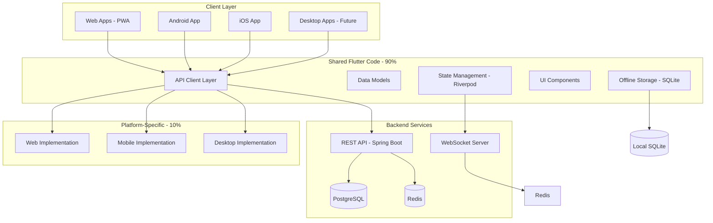
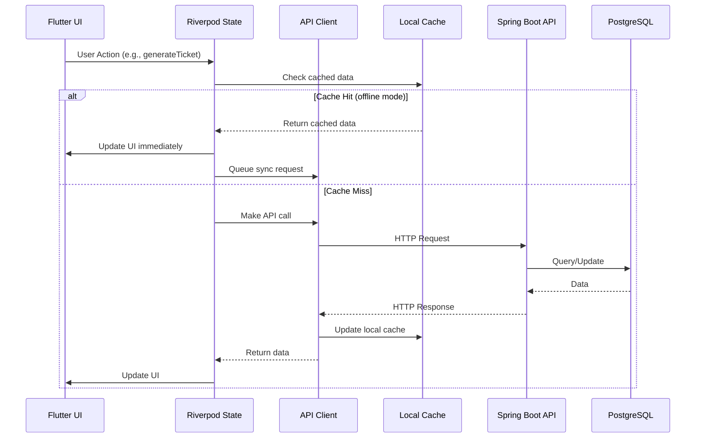

# Cross-Platform Strategy for The Chain

**Version:** 1.0
**Date:** October 9, 2025
**Status:** Strategic Planning Document
**Team:** Backend, API Integration, Mobile Development

---

## Executive Summary

This document outlines The Chain's comprehensive cross-platform strategy to deliver a viral social ticketing application across web, mobile (iOS/Android), and future desktop platforms using a **single Flutter codebase** backed by a **Spring Boot REST API**.

### Key Decisions

| Decision | Rationale | Impact |
|----------|-----------|--------|
| **Single Flutter Codebase** | Maximize code reuse (90%+), consistent UX, faster development | Week 4 MVP viable |
| **Dual App Architecture** | Separate public (marketing) and private (authenticated) apps | Clear user journeys, optimized bundles |
| **REST-first API** | Proven, tooling-rich, cacheable, offline-friendly | Enables offline-first architecture |
| **Progressive Enhancement** | Core features work everywhere, platform-specific enhancements optional | Maximum reach, graceful degradation |
| **Offline-first Data Strategy** | Local SQLite + sync on reconnect | Works in poor network conditions |

### Timeline

- **Week 4 (MVP):** Web (both apps) + Android private app
- **Week 5-8:** iOS app, push notifications, offline sync
- **Future:** Desktop apps (Windows/macOS/Linux), PWA enhancements

---

## Table of Contents

1. [Platform Target Analysis](#platform-target-analysis)
2. [Architecture Overview](#architecture-overview)
3. [Technology Stack](#technology-stack)
4. [Implementation Phases](#implementation-phases)
5. [Success Metrics](#success-metrics)
6. [Risk Mitigation](#risk-mitigation)

---

## Platform Target Analysis

### MVP Platforms (Week 4)

#### ✅ Web (Priority 1)
- **Public App (port 3000):** Marketing, global stats, invite code entry
- **Private App (port 3001):** User dashboard, ticket generation, QR codes
- **Why First:** Zero installation friction, SEO benefits, instant distribution
- **Browser Targets:** Chrome 90+, Firefox 88+, Safari 14+, Edge 90+

**Capabilities:**
- ✅ JWT authentication
- ✅ REST API calls
- ✅ QR code display (generated server-side or client-side)
- ✅ Responsive design (mobile viewport support)
- ⚠️ Limited: Camera access (Web QR scanning), offline storage (5MB quota)

#### ✅ Android (Priority 2)
- **Target SDK:** Android 10 (API 29) minimum, targeting Android 13 (API 33)
- **Why Second:** Largest global market share (70%+), faster review process than iOS
- **Distribution:** Google Play Store + APK direct download

**Capabilities:**
- ✅ Full camera access (QR scanning)
- ✅ Push notifications (FCM)
- ✅ Unlimited offline storage (SQLite)
- ✅ Biometric authentication (fingerprint)
- ✅ Deep linking (thechain://invite/{code})

### Post-MVP Platforms (Week 5-8)

#### iOS (Priority 3)
- **Target:** iOS 14.0+
- **Distribution:** Apple App Store (TestFlight for beta)
- **Timeline:** Week 5 (1 week for submission + review)

**Capabilities:**
- ✅ All Android features
- ✅ Face ID authentication
- ✅ APNs push notifications
- ✅ Superior camera quality for QR scanning

### Future Platforms (Month 3+)

#### Desktop (Windows/macOS/Linux)
- **Use Cases:**
  - Admin dashboard (chain monitoring, rule changes)
  - Power users (bulk ticket management, analytics)
  - Kiosk mode (event registration stations)
- **Flutter Desktop:** Stable as of Flutter 3.0+
- **Timeline:** Post-launch (not essential for viral growth)

---

## Architecture Overview

### High-Level Architecture



### Data Flow



### Dual App Architecture

```
┌─────────────────────────────────────────────────────────────┐
│                     Frontend Architecture                    │
├─────────────────────────────────────────────────────────────┤
│                                                              │
│  ┌────────────────────┐         ┌──────────────────────┐   │
│  │   Public App       │         │   Private App         │   │
│  │   (port 3000)      │         │   (port 3001)         │   │
│  ├────────────────────┤         ├──────────────────────┤   │
│  │ - Landing page     │         │ - Login/Register      │   │
│  │ - Global stats     │         │ - User dashboard      │   │
│  │ - Invite code entry│         │ - Ticket generation   │   │
│  │ - Chain explorer   │         │ - QR scanner          │   │
│  │ - Marketing        │         │ - Profile management  │   │
│  │ - SEO optimized    │         │ - Badge display       │   │
│  └────────────────────┘         └──────────────────────┘   │
│           │                              │                  │
│           └──────────┬───────────────────┘                  │
│                      │                                      │
│         ┌────────────▼────────────┐                        │
│         │   Shared Package        │                        │
│         │   (thechain_shared)     │                        │
│         ├─────────────────────────┤                        │
│         │ - API Client (Dio)      │                        │
│         │ - Models (User, Ticket) │                        │
│         │ - Constants             │                        │
│         │ - Utils (Storage, etc)  │                        │
│         │ - Theme (Dark Mystique) │                        │
│         │ - Widgets (Reusable)    │                        │
│         └─────────────────────────┘                        │
│                      │                                      │
└──────────────────────┼──────────────────────────────────────┘
                       │
                       ▼
          ┌────────────────────────┐
          │   Backend API          │
          │   Spring Boot 3.2      │
          │   (localhost:8080)     │
          └────────────────────────┘
```

**Why Dual Apps?**

1. **Separation of Concerns:** Public app is unauthenticated, private app requires login
2. **Bundle Size:** Public app ships without QR scanner dependencies (smaller = faster load)
3. **App Store Strategy:** Private app goes to stores, public app is web-only
4. **Marketing:** Public app optimized for SEO and social sharing
5. **Development:** Teams can work independently on each app

---

## Technology Stack

### Frontend (Flutter 3.16+)

#### Core Framework
```yaml
dependencies:
  flutter:
    sdk: flutter

  # State Management
  flutter_riverpod: ^2.4.9        # Reactive state management

  # Routing
  go_router: ^13.0.0              # Declarative routing

  # HTTP & API
  dio: ^5.4.0                      # HTTP client with interceptors
  json_annotation: ^4.8.1          # JSON serialization

  # Storage
  flutter_secure_storage: ^9.0.0   # Encrypted token storage
  shared_preferences: ^2.2.2       # App preferences
  sqflite: ^2.3.0                  # Local SQLite database (offline)

  # Device Info
  device_info_plus: ^10.0.1        # Device fingerprinting

  # Platform-Specific
  qr_flutter: ^4.1.0               # QR code generation (all platforms)
  mobile_scanner: ^4.0.1           # QR scanning (mobile only)

  # PWA
  workbox: ^7.0.0                  # Service worker (web only)
```

#### Code Generation
```yaml
dev_dependencies:
  build_runner: ^2.4.8             # Code generation
  json_serializable: ^6.7.1        # JSON code gen
  flutter_launcher_icons: ^0.13.1  # App icons
```

### Backend (Spring Boot 3.2.0)

#### Core Dependencies
```xml
<dependencies>
    <!-- REST API -->
    <dependency>
        <groupId>org.springframework.boot</groupId>
        <artifactId>spring-boot-starter-web</artifactId>
    </dependency>

    <!-- Security & JWT -->
    <dependency>
        <groupId>org.springframework.boot</groupId>
        <artifactId>spring-boot-starter-security</artifactId>
    </dependency>
    <dependency>
        <groupId>io.jsonwebtoken</groupId>
        <artifactId>jjwt-api</artifactId>
        <version>0.12.3</version>
    </dependency>

    <!-- Database -->
    <dependency>
        <groupId>org.springframework.boot</groupId>
        <artifactId>spring-boot-starter-data-jpa</artifactId>
    </dependency>
    <dependency>
        <groupId>org.postgresql</groupId>
        <artifactId>postgresql</artifactId>
    </dependency>

    <!-- Caching -->
    <dependency>
        <groupId>org.springframework.boot</groupId>
        <artifactId>spring-boot-starter-data-redis</artifactId>
    </dependency>

    <!-- Real-time -->
    <dependency>
        <groupId>org.springframework.boot</groupId>
        <artifactId>spring-boot-starter-websocket</artifactId>
    </dependency>

    <!-- QR Codes -->
    <dependency>
        <groupId>com.google.zxing</groupId>
        <artifactId>core</artifactId>
        <version>3.5.2</version>
    </dependency>
</dependencies>
```

---

## Implementation Phases

### Phase 1: Week 4 MVP (Current Status: 80% Complete)

#### ✅ Completed
- [x] Backend API (Spring Boot 3.2)
  - [x] JWT authentication
  - [x] User registration with tickets
  - [x] Ticket generation/validation
  - [x] Chain statistics endpoint
  - [x] CORS enabled for ports 3000, 3001
- [x] Flutter Shared Package
  - [x] API client with Dio
  - [x] Models (User, Ticket, ChainStats)
  - [x] Storage helpers
  - [x] Device fingerprinting
  - [x] Dark Mystique theme
- [x] Public App scaffold
- [x] Private App scaffold
- [x] Docker deployment config

#### ⏳ In Progress (Week 4)
- [ ] **Public App Implementation** (2 days)
  - [ ] Landing page with chain stats
  - [ ] Invite code entry form
  - [ ] Responsive design (mobile/tablet/desktop)
  - [ ] Marketing content

- [ ] **Private App Implementation** (3 days)
  - [ ] Login screen (email/password + device fingerprint)
  - [ ] User dashboard with ticket display
  - [ ] Ticket generation UI
  - [ ] QR code display
  - [ ] Profile management

- [ ] **Web QR Scanning Fallback** (1 day)
  - [ ] Manual code entry (web can't scan QR reliably)
  - [ ] Or: Use browser WebRTC for camera access (experimental)

#### Success Criteria
- ✅ User can visit public app, see live chain stats
- ✅ User can enter invite code, register account
- ✅ User can log into private app
- ✅ User can generate ticket, share QR code (as image download)
- ✅ Works on Chrome, Firefox, Safari desktop + mobile browsers
- ⏱️ Page load < 3 seconds on 4G connection

---

### Phase 2: Week 5-6 (Mobile Release)

#### Android App (5 days)
- [ ] **Build Configuration**
  - [ ] Set up build.gradle for release
  - [ ] Configure ProGuard rules
  - [ ] Generate signing keys
  - [ ] App icons and splash screens

- [ ] **Platform-Specific Features**
  - [ ] Integrate mobile_scanner for QR scanning
  - [ ] Implement FCM push notifications
  - [ ] Biometric authentication (fingerprint)
  - [ ] Deep linking (thechain://invite/{code})

- [ ] **Offline-First Implementation**
  - [ ] SQLite database for local tickets
  - [ ] Background sync service
  - [ ] Conflict resolution logic

- [ ] **Testing**
  - [ ] Device testing (Samsung, Pixel, OnePlus)
  - [ ] Android 10, 11, 12, 13 compatibility
  - [ ] Performance profiling

- [ ] **Google Play Submission**
  - [ ] Store listing (screenshots, description)
  - [ ] Privacy policy
  - [ ] Submit for review (3-7 days)

#### iOS App (5 days, parallel to Android)
- [ ] **Build Configuration**
  - [ ] Xcode project setup
  - [ ] Provisioning profiles
  - [ ] App icons and splash screens

- [ ] **Platform-Specific Features**
  - [ ] Camera permission handling (Info.plist)
  - [ ] APNs push notifications
  - [ ] Face ID/Touch ID authentication
  - [ ] Universal Links (thechain://*)

- [ ] **Testing**
  - [ ] Device testing (iPhone 11+, iPad)
  - [ ] iOS 14, 15, 16, 17 compatibility

- [ ] **App Store Submission**
  - [ ] TestFlight beta
  - [ ] Submit for review (1-3 days)

#### Success Criteria
- ✅ App installs from Google Play / App Store
- ✅ QR scanning works smoothly (< 2 seconds)
- ✅ Push notification received on ticket expiration
- ✅ App works offline (view tickets, queue actions)
- ⏱️ App startup < 2 seconds on mid-range devices

---

### Phase 3: Week 7-8 (Optimization & Real-time)

#### Real-time Features
- [ ] **WebSocket Integration**
  - [ ] Connect to ws://api.thechain.app/ws
  - [ ] Subscribe to chain.stats channel
  - [ ] Live ticker: "User #12345 just joined from Brazil"
  - [ ] Ticket expiration countdown (live updates)

- [ ] **Push Notifications**
  - [ ] "Your ticket expires in 1 hour!"
  - [ ] "Someone just used your ticket!"
  - [ ] "You earned the Chain Savior badge!"

- [ ] **Background Sync**
  - [ ] Sync local changes when app comes online
  - [ ] Retry failed API calls
  - [ ] Conflict resolution (optimistic locking)

#### Performance Optimization
- [ ] **Bundle Size**
  - [ ] Code splitting (defer non-critical features)
  - [ ] Tree shaking (remove unused code)
  - [ ] Image optimization (WebP on web, AVIF future)

- [ ] **Caching**
  - [ ] HTTP caching (Cache-Control headers)
  - [ ] Service worker caching (web)
  - [ ] Memory caching (Riverpod cache strategy)

- [ ] **Rendering**
  - [ ] Lazy loading lists (ListView.builder)
  - [ ] Image lazy loading
  - [ ] Skeleton screens while loading

#### Success Criteria
- ✅ Chain stats update live (no page refresh)
- ✅ Push notifications delivered within 10 seconds
- ✅ Offline actions sync within 30 seconds of reconnection
- ⏱️ First paint < 1.5 seconds (web)
- ⏱️ Bundle size < 2 MB (before gzip)

---

### Phase 4: Month 3+ (Future Enhancements)

#### Desktop Apps
- **Windows:** MSI installer, system tray integration
- **macOS:** DMG installer, menu bar app
- **Linux:** AppImage, Snap, Flatpak

#### PWA Enhancements
- **Installability:** Add to home screen prompts
- **Offline Mode:** Full offline functionality
- **Background Sync:** Sync even when app closed
- **Web Push:** Notifications without app open

#### Advanced Features
- **Multi-language:** i18n support (Spanish, Portuguese, etc.)
- **Accessibility:** Screen reader support, high contrast mode
- **Analytics:** User behavior tracking (privacy-preserving)
- **A/B Testing:** Feature flags, gradual rollouts

---

## Success Metrics

### Technical Metrics

| Metric | Target | Measurement |
|--------|--------|-------------|
| **Code Reuse** | > 90% | Lines shared / total lines |
| **App Size** | < 15 MB (Android), < 20 MB (iOS) | Release APK/IPA size |
| **Startup Time** | < 2 seconds | Time to interactive |
| **API Response** | < 200ms (P95) | Backend monitoring |
| **Offline Support** | 100% core features | Manual testing |
| **Crash Rate** | < 0.5% | Firebase Crashlytics |

### Business Metrics

| Metric | Target | Measurement |
|--------|--------|-------------|
| **Platform Coverage** | 95% users | Web + Android + iOS reach |
| **User Retention (D7)** | > 40% | Firebase Analytics |
| **Ticket Success Rate** | > 70% | Used tickets / generated |
| **Average Load Time** | < 3 seconds | Google Analytics |
| **App Store Rating** | > 4.5 stars | Store reviews |

---

## Risk Mitigation

### Technical Risks

#### Risk 1: Web QR Scanning Limitations
- **Impact:** HIGH - Core feature unusable on web
- **Mitigation:**
  - ✅ Fallback: Manual invite code entry (6-digit codes)
  - ✅ Alternative: Generate unique shareable links (thechain.app/join/ABC123)
  - 🔄 Experimental: Use WebRTC camera API (limited browser support)

#### Risk 2: Platform-Specific Bugs
- **Impact:** MEDIUM - Features break on specific devices
- **Mitigation:**
  - ✅ Comprehensive device testing (20+ physical devices)
  - ✅ Beta testing program (TestFlight, Google Play Beta)
  - ✅ Feature flags (disable broken features remotely)
  - ✅ Detailed crash reporting (Crashlytics)

#### Risk 3: Offline Sync Conflicts
- **Impact:** MEDIUM - Data inconsistencies
- **Mitigation:**
  - ✅ Server-side validation (optimistic locking with version numbers)
  - ✅ Last-write-wins for non-critical data (display name)
  - ✅ User notification on conflict (re-try prompts)

#### Risk 4: App Store Rejections
- **Impact:** HIGH - Delayed launch
- **Mitigation:**
  - ✅ Pre-submission review checklist
  - ✅ Privacy policy compliance (GDPR, CCPA)
  - ✅ Content moderation strategy (no user-generated content in MVP)
  - ✅ Expedited review request if time-sensitive

### Business Risks

#### Risk 5: Poor Mobile Performance
- **Impact:** HIGH - User churn
- **Mitigation:**
  - ✅ Performance budgets (startup < 2s, API < 200ms)
  - ✅ Lighthouse CI (automated performance testing)
  - ✅ Real user monitoring (Firebase Performance)

#### Risk 6: Platform Fragmentation
- **Impact:** MEDIUM - Support burden
- **Mitigation:**
  - ✅ Support only last 3 OS versions (Android 10+, iOS 14+)
  - ✅ Clear deprecation policy (6-month notice)
  - ✅ Analytics to identify low-usage platforms

---

## Decision Framework (Revisited)

### When to Add a Platform

**Criteria:**
1. **User Demand:** > 10% of traffic from that platform
2. **Development Cost:** < 2 weeks per platform
3. **Maintenance Burden:** < 5% of team time
4. **Business Value:** Increases addressable market by > 20%

**Example:** Desktop apps
- User demand: ~5% of web traffic uses desktop
- Dev cost: 1 week (Flutter desktop stable)
- Maintenance: Minimal (shared codebase)
- Business value: Admin tools, kiosk mode (niche but valuable)
- **Decision:** Defer to Month 3+ (not critical for MVP)

---

## Appendix: Platform Comparison

| Feature | Web | Android | iOS | Desktop |
|---------|-----|---------|-----|---------|
| **Distribution** | URL | Google Play | App Store | Installers |
| **Installation** | None | ~30s | ~1min | ~2min |
| **Update Mechanism** | Auto (refresh) | Google Play | App Store | Manual/Auto |
| **Offline Storage** | 5 MB (IndexedDB) | Unlimited | Unlimited | Unlimited |
| **Camera Access** | Limited (WebRTC) | Full | Full | Full |
| **Push Notifications** | Web Push (limited) | FCM | APNs | Native |
| **Biometric Auth** | No | Yes | Yes | Yes (Win Hello) |
| **Deep Linking** | Yes (URLs) | Yes | Yes | Custom protocols |
| **Background Tasks** | Service Worker (limited) | Full | Full | Full |
| **App Store Review** | No | 3-7 days | 1-3 days | No |
| **Development Cost** | Low | Medium | Medium | Low |
| **Maintenance** | Low | Medium | High | Low |

---

## Next Steps

### Immediate Actions (This Week)
1. **Backend Team:** Ensure CORS allows ports 3000, 3001 ✅ (already done)
2. **API Integration Team:** Generate OpenAPI spec from Spring Boot controllers
3. **Mobile Team:** Complete public app implementation (2 days)
4. **Mobile Team:** Complete private app implementation (3 days)

### Week 5 Planning
1. **Mobile Team:** Set up Android Studio project, configure signing
2. **Mobile Team:** Set up Xcode project, configure provisioning
3. **Backend Team:** Implement WebSocket endpoints for real-time updates
4. **API Integration Team:** Set up FCM/APNs infrastructure

---

**Generated by Claude Code - Cross-Platform Team Meeting**
**Last Updated:** October 9, 2025
