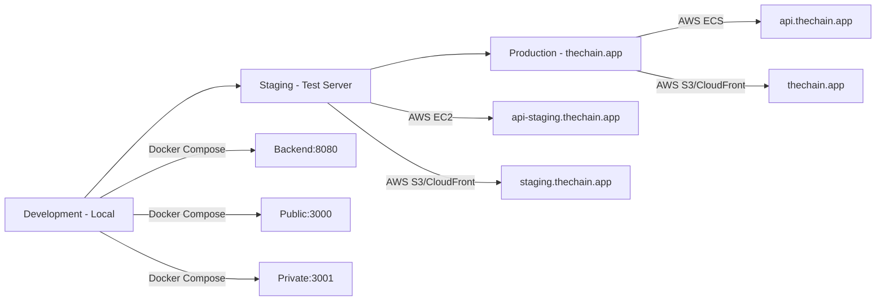

# Deployment Roadmap for The Chain

**Version:** 1.0
**Date:** October 9, 2025
**Status:** Strategic Planning Document
**Owner:** DevOps & Release Engineering

---

## Executive Summary

This document outlines The Chain's deployment strategy from local development to production release across web, Android, and iOS platforms. It includes CI/CD pipeline design, app store submission processes, and version management.

### Key Milestones

| Phase | Timeline | Deliverable | Status |
|-------|----------|-------------|--------|
| **Local Development** | Week 1-3 | Docker Compose setup | ✅ Complete |
| **Web Deployment** | Week 4 | Nginx production hosting | 🚧 In Progress |
| **Android Beta** | Week 5 | Google Play Beta release | ⏳ Planned |
| **iOS Beta** | Week 5-6 | TestFlight release | ⏳ Planned |
| **Production Launch** | Week 8 | Public app store release | ⏳ Planned |

---

## Table of Contents

1. [Environment Overview](#environment-overview)
2. [CI/CD Pipeline](#cicd-pipeline)
3. [Web Deployment](#web-deployment)
4. [Android Deployment](#android-deployment)
5. [iOS Deployment](#ios-deployment)
6. [Version Management](#version-management)
7. [Monitoring & Rollback](#monitoring--rollback)

---

## Environment Overview

### Deployment Environments



---

### Environment Configuration

| Environment | Purpose | Backend URL | Database | Redis |
|-------------|---------|-------------|----------|-------|
| **Local** | Development | http://localhost:8080 | PostgreSQL (Docker) | Redis (Docker) |
| **Staging** | Testing | https://api-staging.thechain.app | AWS RDS (PostgreSQL) | AWS ElastiCache |
| **Production** | Live users | https://api.thechain.app | AWS RDS (Multi-AZ) | AWS ElastiCache (HA) |

---

## CI/CD Pipeline

### GitHub Actions Workflow

```
┌─────────────────────────────────────────────────────────────┐
│                   Git Push to main                          │
└────────────────────────┬────────────────────────────────────┘
                         │
                         ▼
┌─────────────────────────────────────────────────────────────┐
│  Step 1: Build & Test Backend (Maven)                       │
│  - mvn clean test                                            │
│  - JaCoCo coverage report                                    │
│  - Fail if coverage < 80%                                    │
└────────────────────────┬────────────────────────────────────┘
                         │
                         ▼
┌─────────────────────────────────────────────────────────────┐
│  Step 2: Build & Test Frontend (Flutter)                    │
│  - flutter test (shared, public-app, private-app)           │
│  - Fail if any test fails                                   │
└────────────────────────┬────────────────────────────────────┘
                         │
                         ▼
┌─────────────────────────────────────────────────────────────┐
│  Step 3: Build Docker Images                                │
│  - docker build backend                                      │
│  - docker build public-app                                   │
│  - docker build private-app                                  │
│  - Tag: thechain/backend:${GIT_SHA}                         │
└────────────────────────┬────────────────────────────────────┘
                         │
                         ▼
┌─────────────────────────────────────────────────────────────┐
│  Step 4: Push to Container Registry                         │
│  - docker push to AWS ECR / Docker Hub                       │
└────────────────────────┬────────────────────────────────────┘
                         │
                         ▼
┌─────────────────────────────────────────────────────────────┐
│  Step 5: Deploy to Staging                                  │
│  - Update ECS task definition                                │
│  - Deploy new containers                                     │
│  - Run smoke tests                                           │
└────────────────────────┬────────────────────────────────────┘
                         │
                         ▼
┌─────────────────────────────────────────────────────────────┐
│  Step 6: Manual Approval (Production)                       │
│  - Slack notification to team                                │
│  - Require approval from @alpaslan                           │
└────────────────────────┬────────────────────────────────────┘
                         │
                         ▼
┌─────────────────────────────────────────────────────────────┐
│  Step 7: Deploy to Production                               │
│  - Blue/Green deployment (zero downtime)                     │
│  - Health checks before traffic switch                       │
│  - Automatic rollback if health checks fail                  │
└─────────────────────────────────────────────────────────────┘
```

---

### GitHub Actions Configuration

**.github/workflows/deploy.yml**
```yaml
name: Deploy The Chain

on:
  push:
    branches: [main]
  pull_request:
    branches: [main]

env:
  BACKEND_IMAGE: thechain/backend
  PUBLIC_APP_IMAGE: thechain/public-app
  PRIVATE_APP_IMAGE: thechain/private-app

jobs:
  test-backend:
    runs-on: ubuntu-latest
    steps:
      - uses: actions/checkout@v3

      - name: Set up JDK 17
        uses: actions/setup-java@v3
        with:
          distribution: 'temurin'
          java-version: '17'

      - name: Cache Maven packages
        uses: actions/cache@v3
        with:
          path: ~/.m2
          key: ${{ runner.os }}-m2-${{ hashFiles('**/pom.xml') }}

      - name: Run tests
        run: |
          cd backend
          mvn clean test

      - name: Check coverage
        run: |
          cd backend
          mvn jacoco:report
          # Parse coverage report, fail if < 80%

      - name: Upload coverage reports
        uses: codecov/codecov-action@v3
        with:
          files: ./backend/target/site/jacoco/jacoco.xml

  test-flutter:
    runs-on: ubuntu-latest
    steps:
      - uses: actions/checkout@v3

      - name: Set up Flutter
        uses: subosito/flutter-action@v2
        with:
          flutter-version: '3.16.0'

      - name: Test shared package
        run: |
          cd frontend/shared
          flutter pub get
          flutter test

      - name: Test public app
        run: |
          cd frontend/public-app
          flutter pub get
          flutter test

      - name: Test private app
        run: |
          cd frontend/private-app
          flutter pub get
          flutter test

  build-and-push:
    needs: [test-backend, test-flutter]
    runs-on: ubuntu-latest
    if: github.ref == 'refs/heads/main'
    steps:
      - uses: actions/checkout@v3

      - name: Configure AWS credentials
        uses: aws-actions/configure-aws-credentials@v2
        with:
          aws-access-key-id: ${{ secrets.AWS_ACCESS_KEY_ID }}
          aws-secret-access-key: ${{ secrets.AWS_SECRET_ACCESS_KEY }}
          aws-region: us-east-1

      - name: Login to Amazon ECR
        id: login-ecr
        uses: aws-actions/amazon-ecr-login@v1

      - name: Build backend image
        run: |
          cd backend
          docker build -t $BACKEND_IMAGE:${{ github.sha }} .
          docker tag $BACKEND_IMAGE:${{ github.sha }} $BACKEND_IMAGE:latest

      - name: Build public app image
        run: |
          cd frontend
          docker build -f public-app/Dockerfile -t $PUBLIC_APP_IMAGE:${{ github.sha }} .
          docker tag $PUBLIC_APP_IMAGE:${{ github.sha }} $PUBLIC_APP_IMAGE:latest

      - name: Build private app image
        run: |
          cd frontend
          docker build -f private-app/Dockerfile -t $PRIVATE_APP_IMAGE:${{ github.sha }} .
          docker tag $PRIVATE_APP_IMAGE:${{ github.sha }} $PRIVATE_APP_IMAGE:latest

      - name: Push images to ECR
        run: |
          docker push $BACKEND_IMAGE:${{ github.sha }}
          docker push $BACKEND_IMAGE:latest
          docker push $PUBLIC_APP_IMAGE:${{ github.sha }}
          docker push $PUBLIC_APP_IMAGE:latest
          docker push $PRIVATE_APP_IMAGE:${{ github.sha }}
          docker push $PRIVATE_APP_IMAGE:latest

  deploy-staging:
    needs: build-and-push
    runs-on: ubuntu-latest
    steps:
      - name: Deploy to ECS Staging
        run: |
          aws ecs update-service \
            --cluster thechain-staging \
            --service backend \
            --force-new-deployment

      - name: Wait for deployment
        run: |
          aws ecs wait services-stable \
            --cluster thechain-staging \
            --services backend

      - name: Run smoke tests
        run: |
          curl -f https://api-staging.thechain.app/api/v1/actuator/health || exit 1

  deploy-production:
    needs: deploy-staging
    runs-on: ubuntu-latest
    environment:
      name: production
      url: https://thechain.app
    steps:
      - name: Deploy to ECS Production
        run: |
          aws ecs update-service \
            --cluster thechain-production \
            --service backend \
            --force-new-deployment

      - name: Wait for deployment
        run: |
          aws ecs wait services-stable \
            --cluster thechain-production \
            --services backend

      - name: Health check
        run: |
          curl -f https://api.thechain.app/api/v1/actuator/health || exit 1

      - name: Notify team (Slack)
        uses: slackapi/slack-github-action@v1
        with:
          payload: |
            {
              "text": "✅ Deployment to production successful!",
              "blocks": [
                {
                  "type": "section",
                  "text": {
                    "type": "mrkdwn",
                    "text": "Deployment *${{ github.sha }}* to production completed."
                  }
                }
              ]
            }
        env:
          SLACK_WEBHOOK_URL: ${{ secrets.SLACK_WEBHOOK_URL }}
```

---

## Web Deployment

### Production Architecture (AWS)

```
┌──────────────────────────────────────────────────────────┐
│                       Users                              │
└──────────────────────┬───────────────────────────────────┘
                       │
                       ▼
┌──────────────────────────────────────────────────────────┐
│              CloudFront CDN                              │
│  - SSL/TLS (ACM certificate)                             │
│  - Caching (static assets)                               │
│  - Gzip compression                                       │
└──────────────────────┬───────────────────────────────────┘
                       │
           ┌───────────┴───────────┐
           ▼                       ▼
┌──────────────────┐    ┌──────────────────┐
│  S3 Bucket       │    │  ALB (Backend)   │
│  thechain.app    │    │  api.thechain.app│
│  (Static files)  │    └────────┬─────────┘
└──────────────────┘             │
                                 ▼
                      ┌──────────────────┐
                      │  ECS Fargate     │
                      │  Spring Boot API │
                      └────────┬─────────┘
                               │
                   ┌───────────┴───────────┐
                   ▼                       ▼
        ┌──────────────────┐    ┌──────────────────┐
        │  RDS PostgreSQL  │    │  ElastiCache     │
        │  (Multi-AZ)      │    │  Redis           │
        └──────────────────┘    └──────────────────┘
```

---

### Web Build & Deploy Script

**scripts/deploy-web.sh**
```bash
#!/bin/bash
set -e

APP=$1  # "public" or "private"
ENV=$2  # "staging" or "production"

if [ "$APP" != "public" ] && [ "$APP" != "private" ]; then
  echo "Usage: ./deploy-web.sh [public|private] [staging|production]"
  exit 1
fi

echo "Building Flutter $APP app for web..."
cd frontend/${APP}-app
flutter clean
flutter pub get
flutter build web --release --web-renderer canvaskit

echo "Optimizing build..."
# Minify HTML
html-minifier --input-dir build/web --output-dir build/web \
  --collapse-whitespace --remove-comments

# Compress JS/CSS
gzip -9 -r build/web/*.js
gzip -9 -r build/web/*.css

echo "Uploading to S3..."
if [ "$ENV" == "production" ]; then
  S3_BUCKET="thechain-${APP}-app"
  CLOUDFRONT_DIST_ID="E1234567890ABC"
else
  S3_BUCKET="thechain-${APP}-app-staging"
  CLOUDFRONT_DIST_ID="E0987654321XYZ"
fi

aws s3 sync build/web s3://$S3_BUCKET \
  --delete \
  --cache-control "public,max-age=31536000,immutable" \
  --exclude "index.html"

# index.html should not be cached
aws s3 cp build/web/index.html s3://$S3_BUCKET/index.html \
  --cache-control "no-cache,no-store,must-revalidate"

echo "Invalidating CloudFront cache..."
aws cloudfront create-invalidation \
  --distribution-id $CLOUDFRONT_DIST_ID \
  --paths "/*"

echo "✅ Deployment complete: https://${S3_BUCKET}.s3-website-us-east-1.amazonaws.com"
```

---

## Android Deployment

### Google Play Store Release Process

#### Phase 1: Internal Testing (Week 5, Day 1-2)

**Goal:** Validate app functionality on real devices

**Steps:**
1. Build signed APK
   ```bash
   cd frontend/private-app
   flutter build apk --release --split-per-abi
   ```

2. Generate signing key (one-time)
   ```bash
   keytool -genkey -v -keystore ~/thechain-release-key.jks \
     -keyalg RSA -keysize 2048 -validity 10000 \
     -alias thechain
   ```

3. Configure signing in `android/app/build.gradle`
   ```gradle
   android {
     signingConfigs {
       release {
         keyAlias keystoreProperties['keyAlias']
         keyPassword keystoreProperties['keyPassword']
         storeFile keystoreProperties['storeFile'] ? file(keystoreProperties['storeFile']) : null
         storePassword keystoreProperties['storePassword']
       }
     }
     buildTypes {
       release {
         signingConfig signingConfigs.release
         minifyEnabled true
         shrinkResources true
       }
     }
   }
   ```

4. Upload to Google Play Console
   - **App name:** The Chain
   - **Category:** Social
   - **Content rating:** Everyone
   - **Privacy policy:** https://thechain.app/privacy

5. Create internal testing release
   - Upload APKs (armeabi-v7a, arm64-v8a, x86_64)
   - Add internal testers (email list)
   - Wait 1-2 hours for review

6. Send test link to team
   - Install on 10+ devices
   - Test QR scanning, push notifications, offline mode

---

#### Phase 2: Closed Beta (Week 5, Day 3-7)

**Goal:** Gather feedback from 100 beta users

**Steps:**
1. Create beta release in Play Console
   - Promote internal testing build to beta
   - Add beta testers (Google Groups or email list)

2. **Beta Testing Checklist:**
   - [ ] QR scanning works on 20+ devices
   - [ ] Push notifications delivered (FCM)
   - [ ] Offline mode: View tickets without internet
   - [ ] No crashes (check Firebase Crashlytics)
   - [ ] Battery drain < 5% per hour (background)

3. Collect feedback
   - In-app feedback form
   - Beta testing survey (Google Forms)
   - Crashlytics error reports

4. Fix critical bugs
   - Hotfix releases (beta track only)
   - Re-test after each fix

---

#### Phase 3: Production Release (Week 6)

**Goal:** Public launch on Google Play Store

**Steps:**
1. **Pre-submission checklist:**
   - [ ] All beta bugs fixed
   - [ ] Crash rate < 0.5%
   - [ ] Privacy policy published
   - [ ] App Store listing complete:
     - Title: "The Chain - Social Ticketing"
     - Short description (80 chars): "Join the viral chain. Pass your ticket before it expires."
     - Full description (4000 chars): [Marketing copy]
     - Screenshots: 5+ images (1080x1920px)
     - Feature graphic (1024x500px)
     - App icon (512x512px)

2. Submit for review
   - Google Play review: 3-7 days typically
   - Common rejection reasons:
     - Permissions not justified (explain in description)
     - Privacy policy missing/incomplete
     - Crashes on review devices

3. **Day of launch:**
   - Monitor Crashlytics for spikes
   - Monitor Play Console ratings/reviews
   - Respond to negative reviews within 24 hours

4. **Post-launch:**
   - Publish app update every 2-4 weeks
   - A/B test store listing (screenshots, description)
   - Track metrics: Installs, uninstalls, retention

---

### Android CI/CD (Fastlane)

**fastlane/Fastfile**
```ruby
default_platform(:android)

platform :android do
  desc "Deploy to Google Play Internal Testing"
  lane :internal do
    gradle(
      task: "bundle",
      build_type: "Release"
    )

    upload_to_play_store(
      track: 'internal',
      aab: 'build/app/outputs/bundle/release/app-release.aab'
    )
  end

  desc "Promote Internal to Beta"
  lane :beta do
    upload_to_play_store(
      track: 'internal',
      track_promote_to: 'beta',
      skip_upload_apk: true,
      skip_upload_aab: true
    )
  end

  desc "Deploy to Production"
  lane :production do
    upload_to_play_store(
      track: 'beta',
      track_promote_to: 'production',
      skip_upload_apk: true,
      skip_upload_aab: true,
      rollout: '0.1'  # 10% rollout initially
    )
  end

  desc "Increment version"
  lane :bump_version do
    increment_version_code(
      gradle_file_path: "app/build.gradle"
    )
  end
end
```

**Run:**
```bash
fastlane android internal   # Deploy to internal testing
fastlane android beta       # Promote to beta
fastlane android production # Production release (10% rollout)
```

---

## iOS Deployment

### Apple App Store Release Process

#### Phase 1: TestFlight Beta (Week 5-6)

**Goal:** Beta test with 100 users via TestFlight

**Prerequisites:**
- Apple Developer account ($99/year)
- Provisioning profiles configured
- Push notification certificates (APNs)

**Steps:**
1. Build iOS archive
   ```bash
   cd frontend/private-app
   flutter build ios --release
   ```

2. Open in Xcode
   ```bash
   open ios/Runner.xcworkspace
   ```

3. Configure signing
   - Select "Runner" target
   - Signing & Capabilities tab
   - Team: [Your Apple Developer Team]
   - Bundle Identifier: com.thechain.app

4. Archive app
   - Product → Archive (Cmd+B)
   - Wait 5-10 minutes for build

5. Upload to App Store Connect
   - Window → Organizer
   - Select archive → Distribute App
   - App Store Connect → Upload
   - Wait 10-15 minutes for processing

6. Submit for TestFlight review
   - **Export compliance:** No encryption (or apply for exemption)
   - **Beta App Description:** "Social ticketing chain network"
   - **Beta Tester Info:** "Test QR scanning, push notifications"
   - **Review notes:** Provide test account credentials

7. **TestFlight Review:** 24-48 hours
   - If approved, send invites to beta testers
   - Beta testers install via TestFlight app

8. **Beta Testing (1 week):**
   - Collect feedback
   - Fix bugs
   - Upload new builds (repeat steps 1-6)

---

#### Phase 2: App Store Submission (Week 6-7)

**Goal:** Public launch on Apple App Store

**Steps:**
1. **Pre-submission checklist:**
   - [ ] TestFlight beta completed (100+ users, no critical bugs)
   - [ ] App Store listing complete:
     - App name: "The Chain"
     - Subtitle (30 chars): "Social Ticketing Network"
     - Screenshots (iPhone 14 Pro Max, iPad Pro):
       - 5+ screenshots per device
       - Annotate with text overlays
     - App Preview video (optional, 30 seconds)
     - Description (4000 chars): [Marketing copy]
     - Keywords (100 chars): "ticket,social,chain,qr,invite"
     - Support URL: https://thechain.app/support
     - Privacy Policy URL: https://thechain.app/privacy

2. Submit for App Review
   - **Age rating:** 4+ (no objectionable content)
   - **App category:** Social Networking
   - **Content rights:** You own all rights
   - **Advertising identifier:** No (unless using ads)
   - **Review notes:** Provide test account with pre-generated ticket

3. **App Review Timeline:**
   - Initial review: 24-48 hours (usually)
   - If rejected: Fix issues, resubmit (another 24-48 hours)

4. **Common rejection reasons:**
   - **2.1 - App Completeness:** App crashes during review
     - *Solution:* Test thoroughly, provide clear review notes
   - **4.2 - Minimum Functionality:** App doesn't do much
     - *Solution:* Explain the chain concept clearly
   - **5.1.1 - Privacy:** Missing privacy policy or permissions not justified
     - *Solution:* Clear privacy policy, explain camera usage

5. **Day of launch:**
   - Monitor Crashlytics
   - Monitor App Store reviews
   - Respond to reviews

---

### iOS CI/CD (Fastlane)

**fastlane/Fastfile**
```ruby
default_platform(:ios)

platform :ios do
  desc "Push to TestFlight"
  lane :beta do
    increment_build_number(xcodeproj: "Runner.xcodeproj")

    build_app(
      workspace: "Runner.xcworkspace",
      scheme: "Runner",
      export_method: "app-store"
    )

    upload_to_testflight(
      skip_waiting_for_build_processing: true
    )

    slack(
      message: "New TestFlight build uploaded! 🚀",
      slack_url: ENV['SLACK_WEBHOOK_URL']
    )
  end

  desc "Submit to App Store"
  lane :release do
    build_app(
      workspace: "Runner.xcworkspace",
      scheme: "Runner",
      export_method: "app-store"
    )

    upload_to_app_store(
      force: true,
      submit_for_review: true,
      automatic_release: false,
      submission_information: {
        export_compliance_uses_encryption: false,
        add_id_info_uses_idfa: false
      }
    )

    slack(
      message: "App submitted for App Store review! 🎉",
      slack_url: ENV['SLACK_WEBHOOK_URL']
    )
  end
end
```

**Run:**
```bash
fastlane ios beta     # Upload to TestFlight
fastlane ios release  # Submit to App Store
```

---

## Version Management

### Semantic Versioning

**Format:** `MAJOR.MINOR.PATCH+BUILD`

**Example:** `1.2.3+42`
- **MAJOR (1):** Breaking changes (v1 → v2 API migration)
- **MINOR (2):** New features (badge system added)
- **PATCH (3):** Bug fixes (ticket expiration bug)
- **BUILD (42):** Internal build number (auto-incremented)

---

### Version Synchronization

**Backend (pom.xml):**
```xml
<version>1.2.3-SNAPSHOT</version>
```

**Flutter (pubspec.yaml):**
```yaml
version: 1.2.3+42
```

**Build Script:**
```bash
#!/bin/bash
# scripts/bump-version.sh

VERSION=$1  # e.g., "1.2.3"

if [ -z "$VERSION" ]; then
  echo "Usage: ./bump-version.sh 1.2.3"
  exit 1
fi

# Update backend version
sed -i "s/<version>.*<\/version>/<version>$VERSION-SNAPSHOT<\/version>/" backend/pom.xml

# Update Flutter version (increment build number)
cd frontend/shared
BUILD_NUMBER=$(grep -oP 'version: \d+\.\d+\.\d+\+\K\d+' pubspec.yaml)
NEW_BUILD=$((BUILD_NUMBER + 1))
sed -i "s/version: .*/version: $VERSION+$NEW_BUILD/" pubspec.yaml

cd ../public-app
sed -i "s/version: .*/version: $VERSION+$NEW_BUILD/" pubspec.yaml

cd ../private-app
sed -i "s/version: .*/version: $VERSION+$NEW_BUILD/" pubspec.yaml

echo "✅ Version bumped to $VERSION+$NEW_BUILD"
git add backend/pom.xml frontend/*/pubspec.yaml
git commit -m "chore: bump version to $VERSION"
```

---

## Monitoring & Rollback

### Production Monitoring

**Services:**
1. **AWS CloudWatch:** Server metrics (CPU, memory, disk)
2. **Datadog/New Relic:** APM (API response times, error rates)
3. **Sentry/Crashlytics:** Client-side crash reporting
4. **Uptime Robot:** Endpoint health checks (every 5 minutes)

**Alerts:**
```yaml
# Slack alerts
alerts:
  - name: "High Error Rate"
    condition: "error_rate > 5%"
    action: "Notify #engineering"

  - name: "API Response Time"
    condition: "p95_latency > 500ms"
    action: "Notify #devops"

  - name: "Database Connection Pool"
    condition: "active_connections > 80% of max"
    action: "Notify #devops"

  - name: "Mobile Crash Rate"
    condition: "crash_rate > 1%"
    action: "Notify #mobile-team"
```

---

### Rollback Strategy

#### Backend Rollback (ECS)
```bash
# Rollback to previous task definition
aws ecs update-service \
  --cluster thechain-production \
  --service backend \
  --task-definition thechain-backend:42  # Previous version

# Wait for rollback
aws ecs wait services-stable \
  --cluster thechain-production \
  --services backend

# Verify health
curl https://api.thechain.app/api/v1/actuator/health
```

---

#### Web Rollback (S3/CloudFront)
```bash
# S3 versioning enabled, restore previous version
aws s3api list-object-versions \
  --bucket thechain-public-app \
  --prefix index.html

# Restore specific version
aws s3api copy-object \
  --copy-source thechain-public-app/index.html?versionId=ABC123 \
  --bucket thechain-public-app \
  --key index.html

# Invalidate CloudFront cache
aws cloudfront create-invalidation \
  --distribution-id E1234567890ABC \
  --paths "/*"
```

---

#### Mobile Rollback (Staged Rollout)
```bash
# Android: Reduce rollout percentage
fastlane android production rollout:0.1  # Roll back to 10%

# iOS: Pause release
# (Manual action in App Store Connect)
# 1. Go to App Store Connect
# 2. My Apps → The Chain
# 3. App Store → Version → Pause Rollout
```

---

## Appendix: Deployment Checklist

### Pre-Deployment Checklist

**Backend:**
- [ ] All tests passing (JUnit, integration tests)
- [ ] Code coverage > 80%
- [ ] Database migrations tested
- [ ] No hardcoded secrets (use environment variables)
- [ ] API documentation updated (Swagger/OpenAPI)

**Frontend:**
- [ ] All tests passing (unit, widget tests)
- [ ] No console errors in production build
- [ ] Bundle size < 2 MB (web), < 15 MB (mobile)
- [ ] Lighthouse score > 90 (web)
- [ ] Offline mode tested

**Infrastructure:**
- [ ] SSL certificates valid (6+ months remaining)
- [ ] Backup strategy tested (database restore)
- [ ] Monitoring dashboards configured
- [ ] Rollback plan documented

---

### Post-Deployment Checklist

**Day 1:**
- [ ] Monitor error rates (< 1%)
- [ ] Monitor API response times (< 200ms P95)
- [ ] Check mobile crash rates (< 0.5%)
- [ ] Review user feedback (app store reviews, support tickets)

**Week 1:**
- [ ] Analyze user retention (D1, D7 retention)
- [ ] Review performance metrics (page load times)
- [ ] Plan hotfixes if needed

**Month 1:**
- [ ] Review analytics (user growth, feature usage)
- [ ] Plan next release cycle

---

**Generated by Claude Code - DevOps Team**
**Last Updated:** October 9, 2025
