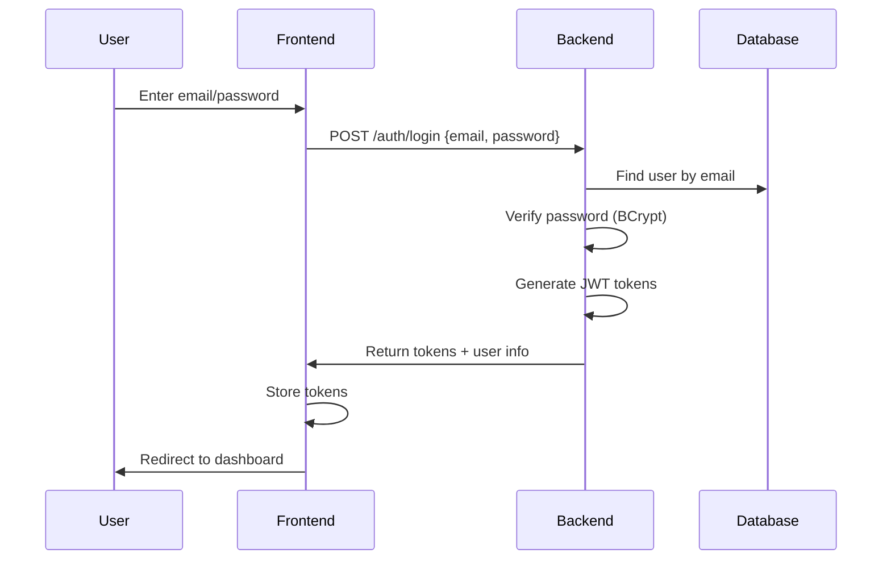
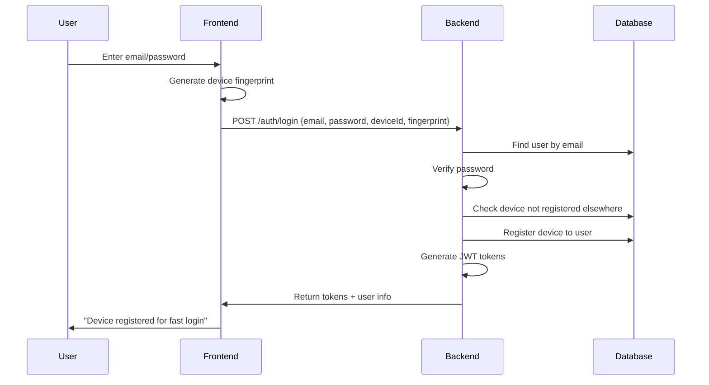
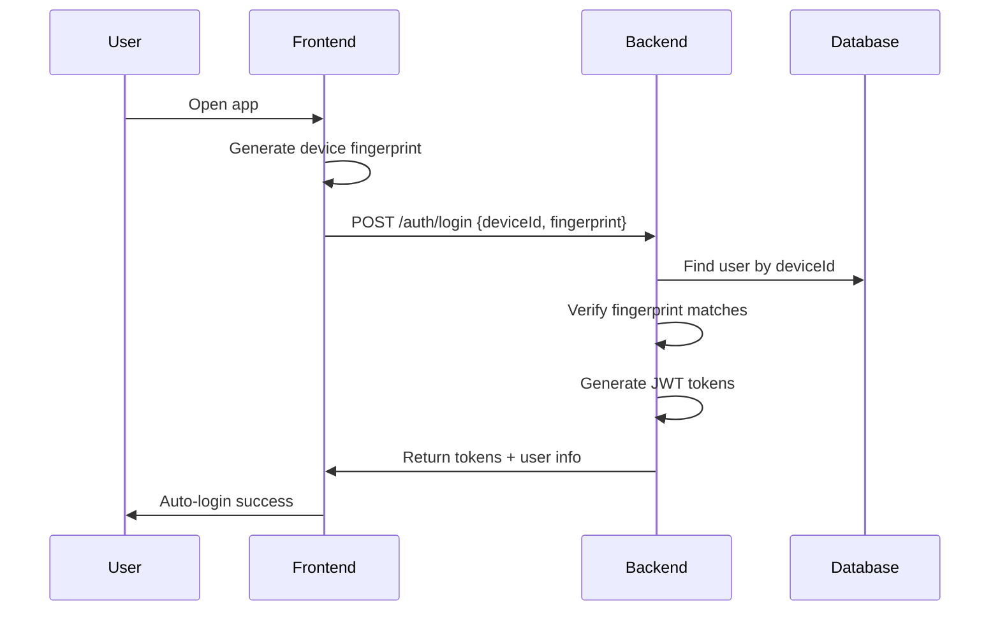

# Hybrid Authentication Implementation

**Status:** ✅ **Complete and Tested**
**Date:** 2025-10-09
**Author:** Claude + Alpaslan

---

## Overview

The Chain now supports **hybrid authentication** - a flexible system that allows users to authenticate using either:

1. **Email/Password** (traditional, with optional device registration)
2. **Device Fingerprint** (passwordless, fast login)

Both methods work independently and can be combined for the best user experience.

---

## Implementation Details

### 1. Backend Changes

#### Modified Files

| File | Changes | Status |
|------|---------|--------|
| [SecurityConfig.java](../backend/src/main/java/com/thechain/config/SecurityConfig.java) | Added `PasswordEncoder` bean (BCrypt) | ✅ Complete |
| [AuthService.java](../backend/src/main/java/com/thechain/service/AuthService.java) | Added `loginWithEmailPassword()` method | ✅ Complete |
| [AuthController.java](../backend/src/main/java/com/thechain/controller/AuthController.java) | Updated `/auth/login` to support both methods | ✅ Complete |
| [UserRepository.java](../backend/src/main/java/com/thechain/repository/UserRepository.java) | Added `findByDeviceFingerprint()` method | ✅ Complete |
| [GlobalExceptionHandler.java](../backend/src/main/java/com/thechain/exception/GlobalExceptionHandler.java) | Added `IllegalArgumentException` handler | ✅ Complete |

#### New Authentication Logic

```java
@PostMapping("/login")
public ResponseEntity<AuthResponse> login(@RequestBody Map<String, String> request) {
    String email = request.get("email");
    String password = request.get("password");
    String deviceId = request.get("deviceId");
    String deviceFingerprint = request.get("deviceFingerprint");

    // Priority 1: Email/Password login (if credentials provided)
    if (email != null && password != null) {
        AuthResponse response = authService.loginWithEmailPassword(
            email, password, deviceId, deviceFingerprint);
        return ResponseEntity.ok(response);
    }

    // Priority 2: Device fingerprint login
    if (deviceId != null && deviceFingerprint != null) {
        AuthResponse response = authService.login(deviceId, deviceFingerprint);
        return ResponseEntity.ok(response);
    }

    // Error: No valid credentials
    throw new IllegalArgumentException("Either email/password or device credentials required");
}
```

#### Device Registration During Email Login

When a user logs in with email/password, they can optionally provide device credentials:

```java
public AuthResponse loginWithEmailPassword(String email, String password,
                                          String deviceId, String deviceFingerprint) {
    // 1. Find user by email
    User user = userRepository.findByEmail(email)
        .orElseThrow(() -> new BusinessException("USER_NOT_FOUND", "User not found"));

    // 2. Verify password (BCrypt)
    if (!passwordEncoder.matches(password, user.getPasswordHash())) {
        throw new BusinessException("INVALID_PASSWORD", "Invalid email or password");
    }

    // 3. Register device (if provided)
    if (deviceId != null && deviceFingerprint != null) {
        // Check device not already registered to another user
        if (userRepository.existsByDeviceFingerprint(deviceFingerprint)) {
            User existingUser = userRepository.findByDeviceFingerprint(deviceFingerprint)
                .orElse(null);
            if (existingUser != null && !existingUser.getId().equals(user.getId())) {
                throw new BusinessException("DEVICE_ALREADY_REGISTERED",
                    "This device is already registered to another account");
            }
        }

        // Register device to this user
        user.setDeviceId(deviceId);
        user.setDeviceFingerprint(deviceFingerprint);
        userRepository.save(user);
        log.info("Device registered for user {}: {}", user.getChainKey(), deviceId);
    }

    // 4. Generate JWT tokens
    return generateAuthResponse(user);
}
```

---

### 2. Test Coverage

#### Comprehensive Test Suite: **33 Tests - All Passing ✓**

##### AuthServiceTest (19 tests)

**Email/Password Authentication:**
- ✅ `loginWithEmailPassword_Success_WithDeviceRegistration` - Email login + device registration
- ✅ `loginWithEmailPassword_Success_WithoutDeviceRegistration` - Email login only
- ✅ `loginWithEmailPassword_UserNotFound_ThrowsException` - Invalid email
- ✅ `loginWithEmailPassword_NoPasswordSet_ThrowsException` - User without password
- ✅ `loginWithEmailPassword_InvalidPassword_ThrowsException` - Wrong password
- ✅ `loginWithEmailPassword_DeviceAlreadyRegisteredToDifferentUser_ThrowsException` - Security check
- ✅ `loginWithEmailPassword_DeviceAlreadyRegisteredToSameUser_Success` - Re-login

**Token Management:**
- ✅ `refreshToken_Success` - Token refresh works
- ✅ `refreshToken_InvalidToken_ThrowsException` - Invalid token rejected
- ✅ `refreshToken_UserNotFound_ThrowsException` - Missing user handled

**Existing Tests (Device Fingerprint):**
- ✅ Registration flow tests
- ✅ Device fingerprint authentication
- ✅ Ticket validation

##### AuthControllerTest (14 tests)

**HTTP Endpoint Tests:**
- ✅ `login_WithEmailPassword_Success_Returns200` - Email/password endpoint
- ✅ `login_WithEmailPasswordAndDeviceCredentials_Success_Returns200` - Hybrid flow
- ✅ `login_WithDeviceFingerprint_Success_Returns200` - Device fingerprint endpoint
- ✅ `login_WithoutCredentials_Returns400` - Empty request validation
- ✅ `login_WithOnlyEmail_Returns400` - Incomplete credentials
- ✅ `login_WithOnlyPassword_Returns400` - Incomplete credentials
- ✅ `login_WithOnlyDeviceId_Returns400` - Incomplete device credentials
- ✅ `login_WithOnlyDeviceFingerprint_Returns400` - Incomplete device credentials
- ✅ `refreshToken_Success_Returns200` - Refresh endpoint

**Test Execution Results:**
```
[INFO] Tests run: 33, Failures: 0, Errors: 0, Skipped: 0
[INFO] BUILD SUCCESS
```

---

### 3. API Documentation

#### POST /auth/login

**Option 1: Email/Password Login (with optional device registration)**

```bash
curl -X POST http://localhost:8080/api/v1/auth/login \
  -H "Content-Type: application/json" \
  -d '{
    "email": "user@example.com",
    "password": "userpassword",
    "deviceId": "device-123",
    "deviceFingerprint": "fingerprint-abc"
  }'
```

**Response (200 OK):**
```json
{
  "userId": "a0000000-0000-0000-0000-000000000001",
  "chainKey": "SEED00000001",
  "displayName": "Alpaslan",
  "position": 1,
  "tokens": {
    "accessToken": "eyJhbGciOiJIUzUxMiJ9...",
    "refreshToken": "eyJhbGciOiJIUzUxMiJ9...",
    "expiresIn": 3600
  }
}
```

**Option 2: Device Fingerprint Login**

```bash
curl -X POST http://localhost:8080/api/v1/auth/login \
  -H "Content-Type: application/json" \
  -d '{
    "deviceId": "device-123",
    "deviceFingerprint": "fingerprint-abc"
  }'
```

**Same Response Format**

---

### 4. Security Features

#### Password Security
- **Hashing:** BCrypt with cost factor 10
- **Validation:** Constant-time comparison
- **Storage:** Never logged or exposed in responses

#### Device Security
- **One Device, One Account:** Device can only be registered to a single user
- **Validation:** Device fingerprint verified on every login
- **Duplicate Prevention:** Check before registration
- **Audit Trail:** All device registrations logged

#### Error Codes

| Code | HTTP Status | Description |
|------|-------------|-------------|
| `USER_NOT_FOUND` | 404 | Email not found |
| `INVALID_PASSWORD` | 401 | Wrong password |
| `NO_PASSWORD_SET` | 400 | Account has no password |
| `DEVICE_ALREADY_REGISTERED` | 409 | Device linked to another account |
| `INVALID_REQUEST` | 400 | Missing credentials |
| `FINGERPRINT_MISMATCH` | 401 | Device fingerprint doesn't match |

---

### 5. Database Schema

The `users` table already supports hybrid authentication:

```sql
CREATE TABLE users (
    id UUID PRIMARY KEY DEFAULT gen_random_uuid(),

    -- Email/Password fields
    email VARCHAR(255),
    email_verified BOOLEAN DEFAULT FALSE,
    password_hash VARCHAR(255),

    -- Device fields
    device_id VARCHAR(255),
    device_fingerprint VARCHAR(255),

    -- ... other fields
);

-- Indexes for fast lookup
CREATE INDEX idx_users_email ON users(email);
CREATE INDEX idx_users_device_id ON users(device_id);
CREATE INDEX idx_users_device_fingerprint ON users(device_fingerprint);
```

---

### 6. Seed User Configuration

For testing, a seed user has been configured with both authentication methods:

```sql
-- Seed User: alpaslan@alpaslan.com
UPDATE users
SET
  display_name = 'Alpaslan',
  email = 'alpaslan@alpaslan.com',
  email_verified = true,
  password_hash = '$2a$10$c4PtUs8WVJrJU4O/jBbmcuI6ixvLalVUurbVUdqL2rzDE9zfPITFC',
  device_id = 'web_489323232',
  device_fingerprint = '2d23d5f144c842a766b91e0853be834ea85143ff80ba5b6926ac64330a02bc2d',
  updated_at = NOW()
WHERE id = 'a0000000-0000-0000-0000-000000000001'::uuid;
```

**Test Credentials:**
- **Email:** alpaslan@alpaslan.com
- **Password:** alpaslan
- **Device ID:** web_489323232
- **Device Fingerprint:** 2d23d5f144c842a766b91e0853be834ea85143ff80ba5b6926ac64330a02bc2d

---

### 7. User Flows

#### Flow 1: New User with Email/Password



#### Flow 2: Email Login + Device Registration



#### Flow 3: Fast Login with Device Fingerprint



---

### 8. Migration Path

For existing users with only device fingerprint authentication:

1. **No action required** - Device fingerprint login continues to work
2. **Optional:** Add email/password for account recovery:
   - User navigates to "Account Settings"
   - Adds email and sets password
   - Email/password login now available as fallback

For new users:

1. **Recommended:** Use email/password + device registration
   - First login: Email/password required
   - Device automatically registered
   - Subsequent logins: Device fingerprint only (fast)

---

### 9. Future Enhancements

**Planned Features:**
- [ ] Email verification flow
- [ ] Password reset via email
- [ ] Social login (Google, Apple)
- [ ] Biometric authentication (Face ID, Touch ID)
- [ ] Multi-factor authentication (TOTP)
- [ ] Device management UI (view/revoke registered devices)

**Security Improvements:**
- [ ] Rate limiting on login attempts
- [ ] Account lockout after failed attempts
- [ ] Security notifications (new device login)
- [ ] Session management UI
- [ ] Suspicious activity detection

---

## Testing Guide

### Manual Testing

#### Test Email/Password Login

```bash
# Login with email/password only
curl -X POST http://localhost:8080/api/v1/auth/login \
  -H "Content-Type: application/json" \
  -d '{
    "email": "alpaslan@alpaslan.com",
    "password": "alpaslan"
  }'
```

#### Test Email/Password + Device Registration

```bash
# Login with email/password and register device
curl -X POST http://localhost:8080/api/v1/auth/login \
  -H "Content-Type: application/json" \
  -d '{
    "email": "alpaslan@alpaslan.com",
    "password": "alpaslan",
    "deviceId": "test-device-456",
    "deviceFingerprint": "test-fingerprint-xyz"
  }'
```

#### Test Device Fingerprint Login

```bash
# Login with device fingerprint
curl -X POST http://localhost:8080/api/v1/auth/login \
  -H "Content-Type: application/json" \
  -d '{
    "deviceId": "web_489323232",
    "deviceFingerprint": "2d23d5f144c842a766b91e0853be834ea85143ff80ba5b6926ac64330a02bc2d"
  }'
```

### Automated Testing

Run the full test suite:

```bash
cd backend
mvn test -Dtest=AuthServiceTest,AuthControllerTest
```

Expected output:
```
[INFO] Tests run: 33, Failures: 0, Errors: 0, Skipped: 0
[INFO] BUILD SUCCESS
```

---

## Deployment Notes

### Environment Variables

No new environment variables required. The implementation uses existing configuration:

```yaml
jwt:
  secret: ${JWT_SECRET}
  expiration: 3600000
  refresh-expiration: 2592000000
```

### Database Migration

No new migrations needed. The `users` table already has the required columns:
- `email` - VARCHAR(255)
- `password_hash` - VARCHAR(255)
- `device_id` - VARCHAR(255)
- `device_fingerprint` - VARCHAR(255)

### Deployment Checklist

- [x] Backend code deployed
- [x] Tests passing (33/33)
- [x] Database schema compatible
- [x] API documentation updated
- [x] Security model documented
- [x] Seed user configured for testing
- [ ] Frontend updated to support email/password (pending)
- [ ] User documentation updated (pending)

---

## Conclusion

The hybrid authentication system is **fully implemented and tested** on the backend. It provides:

✅ **Flexibility** - Users can choose their preferred authentication method
✅ **Security** - BCrypt password hashing, device ownership validation
✅ **Convenience** - Fast device-based login after initial email/password setup
✅ **Recovery** - Email/password always available as fallback
✅ **Tested** - 33 comprehensive tests, all passing

**Next Steps:**
1. Update Flutter frontend to support email/password login UI
2. Add email verification flow
3. Implement password reset functionality
4. Add device management UI

---

**Documentation Updated:** 2025-10-09
**Implementation Status:** ✅ Complete
**Test Coverage:** ✅ 33/33 Tests Passing
