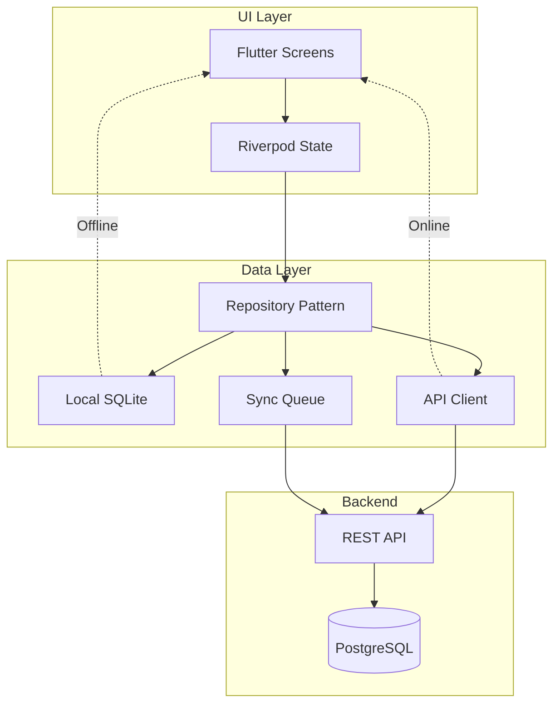
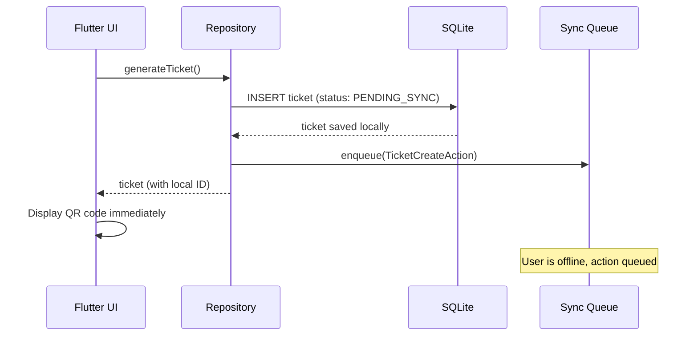
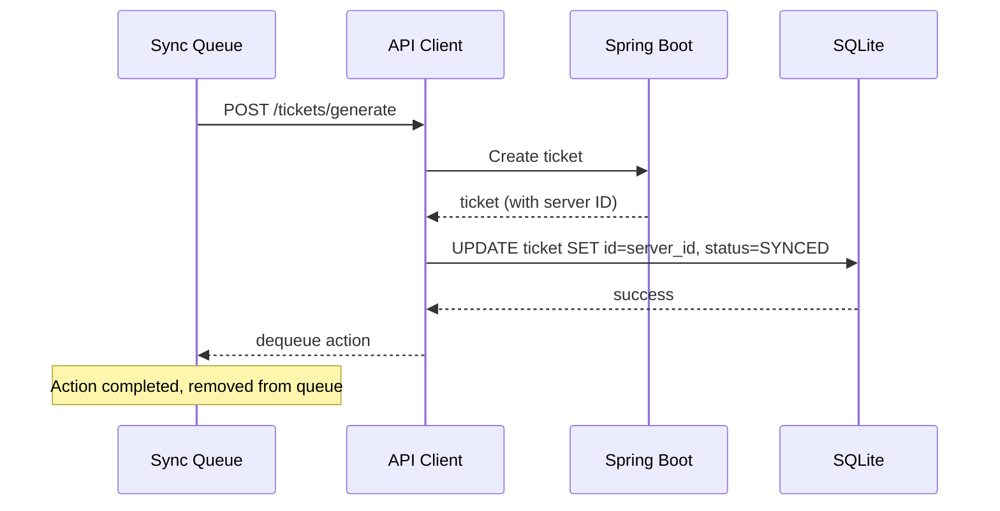
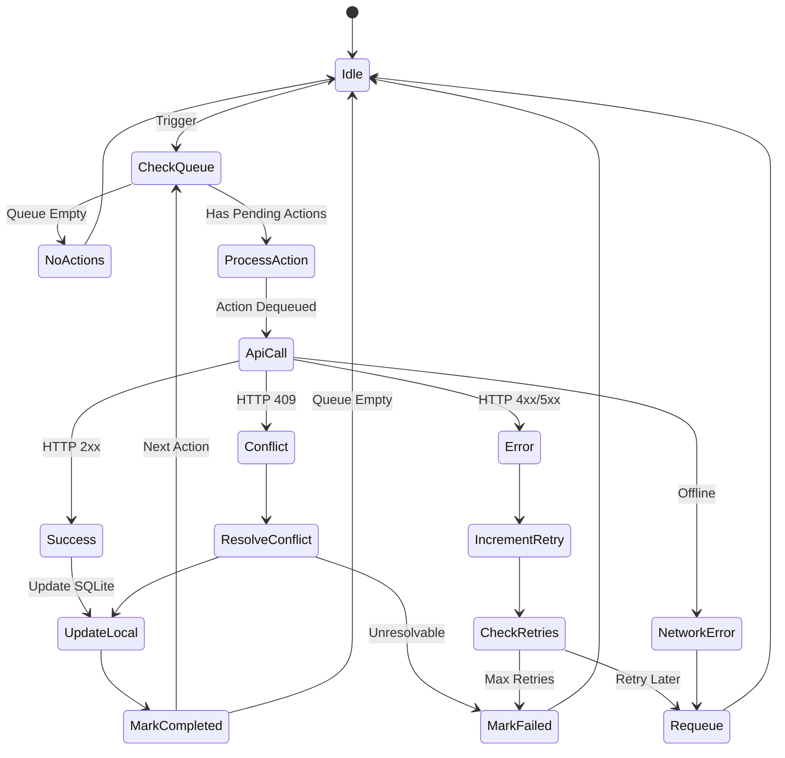

# Offline-First Architecture for The Chain

**Version:** 1.0
**Date:** October 9, 2025
**Status:** Strategic Planning Document
**Owner:** Mobile Development Team

---

## Executive Summary

This document outlines The Chain's offline-first architecture to ensure core features work without internet connectivity, with automatic synchronization when the connection is restored. This is critical for viral growth in regions with unreliable networks.

### Key Decisions

| Decision | Rationale | Impact |
|----------|-----------|--------|
| **Local SQLite Database** | Mature, Flutter-native, unlimited storage | All ticket data available offline |
| **Optimistic UI Updates** | Instant feedback, queue actions for sync | Better UX, no loading spinners |
| **Last-Write-Wins Conflicts** | Simple, predictable for user-generated data | Rare data loss (acceptable) |
| **Server-Side Validation** | Backend is source of truth | Prevents ticket fraud |
| **Background Sync** | Auto-sync when online, retry on failure | Transparent to user |

### Critical Offline Features

| Feature | Offline Support | Notes |
|---------|----------------|-------|
| **View Active Tickets** | ✅ Full | Cached in SQLite |
| **Display QR Code** | ✅ Full | Pre-generated server-side |
| **View Chain Stats** | ⚠️ Stale Cache | Last fetched data (with timestamp) |
| **Generate Ticket** | ⏳ Queued | Created locally, synced when online |
| **Scan QR Code** | ❌ Requires Online | Must validate with server |
| **View Profile** | ✅ Full | Cached in SQLite |

---

## Table of Contents

1. [Architecture Overview](#architecture-overview)
2. [Local Database Schema](#local-database-schema)
3. [Sync Protocol](#sync-protocol)
4. [Conflict Resolution](#conflict-resolution)
5. [Implementation Guide](#implementation-guide)
6. [Testing Strategy](#testing-strategy)

---

## Architecture Overview

### Three-Layer Architecture



### Data Flow: Offline Mode



### Data Flow: Online Sync



---

## Local Database Schema

### SQLite Tables

#### 1. `tickets` Table
```sql
CREATE TABLE tickets (
    -- Identity
    id TEXT PRIMARY KEY,               -- Server ID (UUID) or local temp ID
    local_id TEXT UNIQUE,              -- Temporary ID before server sync
    owner_id TEXT NOT NULL,            -- User ID

    -- Ticket Data
    ticket_code TEXT,
    qr_payload TEXT,
    qr_code_url TEXT,
    signature TEXT,
    next_position INTEGER,

    -- Timestamps
    issued_at INTEGER NOT NULL,        -- Unix timestamp (milliseconds)
    expires_at INTEGER NOT NULL,
    claimed_at INTEGER,
    used_at INTEGER,

    -- Status
    status TEXT NOT NULL,              -- ACTIVE, USED, EXPIRED, CANCELLED
    sync_status TEXT NOT NULL,         -- SYNCED, PENDING_SYNC, SYNC_ERROR

    -- Sync Metadata
    created_at INTEGER NOT NULL,       -- Local creation time
    updated_at INTEGER NOT NULL,       -- Local update time
    synced_at INTEGER,                 -- Last successful sync time
    version INTEGER DEFAULT 1,         -- Optimistic locking version

    FOREIGN KEY (owner_id) REFERENCES users(id)
);

CREATE INDEX idx_tickets_owner ON tickets(owner_id);
CREATE INDEX idx_tickets_status ON tickets(status);
CREATE INDEX idx_tickets_sync ON tickets(sync_status);
```

**Example Row:**
```json
{
  "id": "550e8400-e29b-41d4-a716-446655440000",
  "local_id": "local_1696780800000_abc",
  "owner_id": "user-123",
  "ticket_code": "ABC123",
  "qr_payload": "base64-encoded-data",
  "qr_code_url": "https://cdn.thechain.app/qr/550e8400.png",
  "issued_at": 1696780800000,
  "expires_at": 1696867200000,
  "status": "ACTIVE",
  "sync_status": "SYNCED",
  "version": 1
}
```

---

#### 2. `users` Table
```sql
CREATE TABLE users (
    -- Identity
    id TEXT PRIMARY KEY,               -- Server ID (UUID)
    chain_key TEXT UNIQUE,
    position INTEGER,

    -- Profile
    display_name TEXT NOT NULL,
    email TEXT,
    avatar_emoji TEXT DEFAULT '👤',

    -- Relationships
    parent_id TEXT,
    inviter_position INTEGER,
    invitee_position INTEGER,

    -- Statistics
    wasted_tickets_count INTEGER DEFAULT 0,
    total_tickets_generated INTEGER DEFAULT 0,

    -- Sync
    sync_status TEXT NOT NULL,         -- SYNCED, PENDING_SYNC
    created_at INTEGER NOT NULL,
    updated_at INTEGER NOT NULL,
    synced_at INTEGER,
    version INTEGER DEFAULT 1
);

CREATE INDEX idx_users_position ON users(position);
```

---

#### 3. `chain_stats` Table
```sql
CREATE TABLE chain_stats (
    id INTEGER PRIMARY KEY CHECK (id = 1), -- Singleton table (1 row only)

    -- Statistics
    total_users INTEGER NOT NULL,
    active_tickets INTEGER NOT NULL,
    total_wasted_tickets INTEGER NOT NULL,
    waste_rate REAL NOT NULL,

    -- Metadata
    last_updated INTEGER NOT NULL,     -- Server timestamp
    cached_at INTEGER NOT NULL,        -- Local cache timestamp

    version INTEGER DEFAULT 1
);
```

**Purpose:** Cache global stats for offline viewing (stale data acceptable).

---

#### 4. `sync_queue` Table
```sql
CREATE TABLE sync_queue (
    id INTEGER PRIMARY KEY AUTOINCREMENT,

    -- Action Details
    action_type TEXT NOT NULL,         -- TICKET_CREATE, PROFILE_UPDATE, etc.
    entity_type TEXT NOT NULL,         -- tickets, users, etc.
    entity_id TEXT NOT NULL,           -- ID of affected entity

    -- Payload
    payload TEXT NOT NULL,             -- JSON-encoded request body

    -- Status
    status TEXT NOT NULL,              -- PENDING, IN_PROGRESS, FAILED, COMPLETED
    retry_count INTEGER DEFAULT 0,
    max_retries INTEGER DEFAULT 3,

    -- Error Handling
    error_message TEXT,
    last_error_at INTEGER,

    -- Timestamps
    created_at INTEGER NOT NULL,
    updated_at INTEGER NOT NULL,
    completed_at INTEGER
);

CREATE INDEX idx_queue_status ON sync_queue(status);
CREATE INDEX idx_queue_created ON sync_queue(created_at);
```

**Example Row:**
```json
{
  "id": 1,
  "action_type": "TICKET_CREATE",
  "entity_type": "tickets",
  "entity_id": "local_1696780800000_abc",
  "payload": "{\"message\":\"Join my chain!\"}",
  "status": "PENDING",
  "retry_count": 0,
  "created_at": 1696780800000
}
```

---

#### 5. `app_metadata` Table
```sql
CREATE TABLE app_metadata (
    key TEXT PRIMARY KEY,
    value TEXT NOT NULL,
    updated_at INTEGER NOT NULL
);

-- Store:
-- - last_sync_timestamp
-- - user_id (current logged-in user)
-- - api_base_url
-- - app_version
```

---

## Sync Protocol

### Sync Triggers

1. **App Startup:** Check for pending actions
2. **Network Restored:** Connectivity change listener
3. **Background Timer:** Every 5 minutes (when app in foreground)
4. **Manual Refresh:** User pull-to-refresh gesture

### Sync Flow



---

### Sync Action Types

#### 1. Ticket Creation
**Local Action:**
```dart
Future<Ticket> generateTicket({String? message}) async {
  // Step 1: Create ticket locally with temporary ID
  final localTicket = Ticket(
    id: 'local_${DateTime.now().millisecondsSinceEpoch}_${uuid.v4()}',
    ownerId: currentUser.id,
    issuedAt: DateTime.now(),
    expiresAt: DateTime.now().add(Duration(hours: 24)),
    status: TicketStatus.active,
    syncStatus: SyncStatus.pendingSync,
  );

  await _localDb.insertTicket(localTicket);

  // Step 2: Queue sync action
  await _syncQueue.enqueue(SyncAction(
    actionType: ActionType.ticketCreate,
    entityType: 'tickets',
    entityId: localTicket.id,
    payload: jsonEncode({'message': message}),
  ));

  // Step 3: Trigger background sync
  _syncService.triggerSync();

  return localTicket;
}
```

**Server Sync:**
```dart
Future<void> _syncTicketCreate(SyncAction action) async {
  final response = await _apiClient.post(
    '/tickets/generate',
    data: jsonDecode(action.payload),
  );

  final serverTicket = Ticket.fromJson(response.data);

  // Update local ticket with server ID
  await _localDb.updateTicket(
    localId: action.entityId,
    serverId: serverTicket.id,
    syncStatus: SyncStatus.synced,
  );
}
```

---

#### 2. Profile Update
**Local Action:**
```dart
Future<void> updateProfile({String? displayName}) async {
  // Step 1: Update local user immediately (optimistic)
  final updatedUser = currentUser.copyWith(
    displayName: displayName,
    syncStatus: SyncStatus.pendingSync,
    version: currentUser.version + 1,
  );

  await _localDb.updateUser(updatedUser);

  // Step 2: Queue sync
  await _syncQueue.enqueue(SyncAction(
    actionType: ActionType.profileUpdate,
    entityType: 'users',
    entityId: currentUser.id,
    payload: jsonEncode({'displayName': displayName}),
  ));

  // UI updates immediately (no waiting for server)
}
```

**Server Sync:**
```dart
Future<void> _syncProfileUpdate(SyncAction action) async {
  final response = await _apiClient.put(
    '/users/me',
    data: jsonDecode(action.payload),
  );

  final serverUser = User.fromJson(response.data);

  // Check for conflicts (server version > local version)
  final localUser = await _localDb.getUserById(action.entityId);

  if (serverUser.version > localUser.version) {
    // Server has newer data, merge or overwrite
    await _resolveUserConflict(localUser, serverUser);
  } else {
    // Our update succeeded, mark as synced
    await _localDb.updateUser(
      localUser.copyWith(
        syncStatus: SyncStatus.synced,
        syncedAt: DateTime.now(),
      ),
    );
  }
}
```

---

## Conflict Resolution

### Conflict Types

#### 1. Ticket Generation Conflict
**Scenario:** User generates ticket offline, ticket expires before sync

**Server Response:**
```json
HTTP 409 Conflict
{
  "error": {
    "code": "TICKET_ALREADY_EXPIRED",
    "message": "Ticket expired before sync could complete"
  }
}
```

**Resolution:**
```dart
Future<void> _resolveTicketConflict(Ticket localTicket, ApiException error) async {
  if (error.code == 'TICKET_ALREADY_EXPIRED') {
    // Mark local ticket as expired
    await _localDb.updateTicket(
      localTicket.copyWith(
        status: TicketStatus.expired,
        syncStatus: SyncStatus.syncError,
      ),
    );

    // Show user notification
    _notificationService.show(
      'Your ticket expired before it could be synced. Please generate a new one.',
    );
  }
}
```

---

#### 2. Profile Update Conflict (Last-Write-Wins)
**Scenario:** User updates displayName offline, someone else updates it on server

**Server State:**
```json
{
  "displayName": "ServerName",
  "version": 5,
  "updatedAt": "2025-10-09T14:00:00Z"
}
```

**Local State:**
```json
{
  "displayName": "LocalName",
  "version": 4,
  "updatedAt": "2025-10-09T13:00:00Z"
}
```

**Resolution (Last-Write-Wins):**
```dart
Future<void> _resolveUserConflict(User localUser, User serverUser) async {
  if (serverUser.updatedAt.isAfter(localUser.updatedAt)) {
    // Server version is newer, discard local changes
    await _localDb.updateUser(serverUser.copyWith(
      syncStatus: SyncStatus.synced,
    ));

    _notificationService.show(
      'Profile changes were overwritten by newer server data',
    );
  } else {
    // Local version is newer, retry sync (force update)
    await _apiClient.put(
      '/users/me',
      data: localUser.toJson(),
      headers: {'If-Match': serverUser.version.toString()},
    );
  }
}
```

---

#### 3. Chain Position Conflict (Server Wins)
**Scenario:** Server moves user position during offline period

**Server Response:**
```json
{
  "position": 12345,  // Server changed this
  "version": 10
}
```

**Local State:**
```json
{
  "position": 12340,  // Old cached position
  "version": 8
}
```

**Resolution (Server Wins - Critical Data):**
```dart
Future<void> _resolvePositionConflict(User localUser, User serverUser) async {
  // Position is server-authoritative, always accept server value
  await _localDb.updateUser(serverUser.copyWith(
    syncStatus: SyncStatus.synced,
  ));

  // No notification needed (user doesn't control position)
}
```

---

### Optimistic Locking

**Version-Based Locking:**
```dart
// Client sends version with update
PUT /users/me
Headers:
  If-Match: "4"  // Expected server version
Body:
  { "displayName": "NewName" }

// Server checks version
if (currentUser.version != requestedVersion) {
  return 409 Conflict;
}

// Server increments version
currentUser.version++;
currentUser.displayName = "NewName";
save(currentUser);

return 200 OK;
```

---

## Implementation Guide

### 1. Repository Pattern

```dart
abstract class TicketRepository {
  Future<List<Ticket>> getMyTickets();
  Future<Ticket> generateTicket({String? message});
  Future<Ticket> getTicketById(String id);
}

class OfflineFirstTicketRepository implements TicketRepository {
  final TicketLocalDataSource _localDataSource;
  final TicketRemoteDataSource _remoteDataSource;
  final SyncQueue _syncQueue;
  final ConnectivityService _connectivity;

  @override
  Future<Ticket> generateTicket({String? message}) async {
    // Always create locally first
    final localTicket = await _localDataSource.createTicket(
      ownerId: currentUser.id,
      message: message,
      syncStatus: SyncStatus.pendingSync,
    );

    // Queue for sync
    await _syncQueue.enqueue(SyncAction(
      actionType: ActionType.ticketCreate,
      entityId: localTicket.id,
      payload: jsonEncode({'message': message}),
    ));

    // Trigger sync if online
    if (await _connectivity.isConnected) {
      _syncService.triggerSync();
    }

    return localTicket;
  }

  @override
  Future<List<Ticket>> getMyTickets() async {
    // Always return local data immediately
    final localTickets = await _localDataSource.getTickets();

    // Fetch from server in background (don't await)
    unawaited(_refreshFromServer());

    return localTickets;
  }

  Future<void> _refreshFromServer() async {
    if (!await _connectivity.isConnected) return;

    try {
      final serverTickets = await _remoteDataSource.getMyTickets();

      // Merge server data into local DB
      for (final ticket in serverTickets) {
        await _localDataSource.upsertTicket(ticket.copyWith(
          syncStatus: SyncStatus.synced,
        ));
      }
    } catch (e) {
      // Silent failure, local data still available
      _logger.warn('Failed to refresh from server: $e');
    }
  }
}
```

---

### 2. Sync Service

```dart
class SyncService {
  final SyncQueue _queue;
  final ApiClient _apiClient;
  final ConnectivityService _connectivity;

  Timer? _syncTimer;

  void init() {
    // Sync on connectivity change
    _connectivity.onConnectivityChanged.listen((isConnected) {
      if (isConnected) {
        triggerSync();
      }
    });

    // Periodic sync (every 5 minutes)
    _syncTimer = Timer.periodic(Duration(minutes: 5), (_) {
      triggerSync();
    });
  }

  Future<void> triggerSync() async {
    if (!await _connectivity.isConnected) return;

    final pendingActions = await _queue.getPending();

    for (final action in pendingActions) {
      await _processAction(action);
    }
  }

  Future<void> _processAction(SyncAction action) async {
    try {
      // Mark as in progress
      await _queue.updateStatus(action.id, SyncStatus.inProgress);

      // Execute action
      switch (action.actionType) {
        case ActionType.ticketCreate:
          await _syncTicketCreate(action);
          break;
        case ActionType.profileUpdate:
          await _syncProfileUpdate(action);
          break;
        // ... other action types
      }

      // Mark as completed
      await _queue.updateStatus(action.id, SyncStatus.completed);

    } catch (e) {
      // Increment retry count
      final newRetryCount = action.retryCount + 1;

      if (newRetryCount >= action.maxRetries) {
        // Mark as failed
        await _queue.updateStatus(
          action.id,
          SyncStatus.failed,
          errorMessage: e.toString(),
        );

        // Notify user
        _notificationService.show('Sync failed: ${action.actionType}');
      } else {
        // Requeue for retry
        await _queue.incrementRetry(action.id, e.toString());
      }
    }
  }

  void dispose() {
    _syncTimer?.cancel();
  }
}
```

---

### 3. Connectivity Service

```dart
import 'package:connectivity_plus/connectivity_plus.dart';

class ConnectivityService {
  final Connectivity _connectivity = Connectivity();
  final StreamController<bool> _controller = StreamController.broadcast();

  Stream<bool> get onConnectivityChanged => _controller.stream;

  Future<bool> get isConnected async {
    final result = await _connectivity.checkConnectivity();
    return result != ConnectivityResult.none;
  }

  void init() {
    _connectivity.onConnectivityChanged.listen((result) {
      _controller.add(result != ConnectivityResult.none);
    });
  }

  void dispose() {
    _controller.close();
  }
}
```

---

### 4. UI Integration (Riverpod)

```dart
@riverpod
class TicketsNotifier extends _$TicketsNotifier {
  @override
  Future<List<Ticket>> build() async {
    final repo = ref.read(ticketRepositoryProvider);
    return repo.getMyTickets();
  }

  Future<void> generateTicket({String? message}) async {
    final repo = ref.read(ticketRepositoryProvider);

    // Optimistically add ticket to UI
    state = AsyncLoading();

    try {
      final newTicket = await repo.generateTicket(message: message);

      // Update UI immediately (ticket may not be synced yet)
      state = AsyncData([...?state.value, newTicket]);

      // Show notification about sync status
      if (newTicket.syncStatus == SyncStatus.pendingSync) {
        ref.read(snackbarProvider).show(
          'Ticket created. Will sync when online.',
        );
      }
    } catch (e) {
      state = AsyncError(e, StackTrace.current);
    }
  }
}
```

---

## Testing Strategy

### Unit Tests

#### Test: Offline Ticket Generation
```dart
test('generateTicket creates local ticket when offline', () async {
  // Arrange
  final mockConnectivity = MockConnectivity();
  when(mockConnectivity.isConnected).thenAnswer((_) async => false);

  final repo = OfflineFirstTicketRepository(
    localDataSource: localDataSource,
    remoteDataSource: remoteDataSource,
    connectivity: mockConnectivity,
  );

  // Act
  final ticket = await repo.generateTicket(message: 'Test');

  // Assert
  expect(ticket.id, startsWith('local_'));
  expect(ticket.syncStatus, SyncStatus.pendingSync);
  verify(localDataSource.createTicket(any)).called(1);
  verifyNever(remoteDataSource.createTicket(any)); // No API call
});
```

---

#### Test: Sync Queue Processing
```dart
test('sync queue processes pending actions when online', () async {
  // Arrange
  await syncQueue.enqueue(SyncAction(
    actionType: ActionType.ticketCreate,
    entityId: 'local_123',
    payload: '{"message":"Test"}',
  ));

  final mockConnectivity = MockConnectivity();
  when(mockConnectivity.isConnected).thenAnswer((_) async => true);

  // Act
  await syncService.triggerSync();

  // Assert
  final completedActions = await syncQueue.getCompleted();
  expect(completedActions.length, 1);
  verify(apiClient.post('/tickets/generate', any)).called(1);
});
```

---

### Integration Tests

#### Test: End-to-End Offline Flow
```dart
testWidgets('user can generate ticket offline and sync when online', (tester) async {
  // Arrange: Start offline
  await tester.pumpWidget(MyApp());
  await mockConnectivity.setOffline();

  // Act 1: Generate ticket offline
  await tester.tap(find.byKey(Key('generate_ticket_button')));
  await tester.pump();

  // Assert: Ticket shown with pending status
  expect(find.byType(TicketCard), findsOneWidget);
  expect(find.text('Pending sync...'), findsOneWidget);

  // Act 2: Go online
  await mockConnectivity.setOnline();
  await tester.pump(Duration(seconds: 2)); // Wait for sync

  // Assert: Ticket synced
  expect(find.text('Pending sync...'), findsNothing);
  expect(find.text('Active'), findsOneWidget);
});
```

---

### Manual Testing Checklist

- [ ] **Airplane Mode Test**
  - Enable airplane mode
  - Generate ticket
  - Verify ticket shown with QR code
  - Disable airplane mode
  - Verify ticket syncs within 30 seconds

- [ ] **Poor Network Test**
  - Use network throttling (Chrome DevTools)
  - Limit to "Slow 3G"
  - Generate ticket
  - Verify optimistic UI (no spinner)
  - Wait for sync confirmation

- [ ] **Conflict Test**
  - Open app on Device A
  - Open app on Device B
  - Go offline on both
  - Update displayName on Device A
  - Update displayName on Device B (different value)
  - Go online on Device A (syncs first)
  - Go online on Device B (conflict!)
  - Verify last-write-wins behavior

- [ ] **Sync Failure Test**
  - Simulate server error (500 response)
  - Verify retry logic
  - Verify max retries (3)
  - Verify user notification

---

## Performance Considerations

### Database Optimization

#### Indexes
```sql
-- Critical indexes for query performance
CREATE INDEX idx_tickets_owner_status ON tickets(owner_id, status);
CREATE INDEX idx_sync_queue_status_created ON sync_queue(status, created_at);
CREATE INDEX idx_users_position ON users(position);
```

#### Query Optimization
```dart
// Bad: Load all tickets into memory
final tickets = await db.query('tickets'); // May be 1000+ rows

// Good: Paginated query
final tickets = await db.query(
  'tickets',
  where: 'owner_id = ?',
  whereArgs: [userId],
  orderBy: 'created_at DESC',
  limit: 20,
);
```

---

### Cache Invalidation

```dart
class CachePolicy {
  // Stale-while-revalidate strategy
  static const maxAge = Duration(minutes: 5);
  static const staleAge = Duration(hours: 1);

  static bool isStale(DateTime cachedAt) {
    return DateTime.now().difference(cachedAt) > maxAge;
  }

  static bool isExpired(DateTime cachedAt) {
    return DateTime.now().difference(cachedAt) > staleAge;
  }
}

// Usage
Future<ChainStats> getChainStats() async {
  final cached = await _localDb.getChainStats();

  if (cached != null && !CachePolicy.isExpired(cached.cachedAt)) {
    // Return stale data immediately
    final stats = cached;

    // Revalidate in background if stale
    if (CachePolicy.isStale(cached.cachedAt)) {
      unawaited(_refreshChainStats());
    }

    return stats;
  }

  // Cache expired or missing, fetch from server
  return await _refreshChainStats();
}
```

---

## Appendix: Sync Status UI

### Status Indicator Component

```dart
class SyncStatusIndicator extends ConsumerWidget {
  @override
  Widget build(BuildContext context, WidgetRef ref) {
    final syncStatus = ref.watch(syncStatusProvider);

    return AnimatedContainer(
      duration: Duration(milliseconds: 300),
      padding: EdgeInsets.symmetric(horizontal: 12, vertical: 6),
      decoration: BoxDecoration(
        color: _getStatusColor(syncStatus),
        borderRadius: BorderRadius.circular(12),
      ),
      child: Row(
        mainAxisSize: MainAxisSize.min,
        children: [
          Icon(_getStatusIcon(syncStatus), size: 16, color: Colors.white),
          SizedBox(width: 6),
          Text(
            _getStatusText(syncStatus),
            style: TextStyle(color: Colors.white, fontSize: 12),
          ),
        ],
      ),
    );
  }

  Color _getStatusColor(SyncStatus status) {
    switch (status) {
      case SyncStatus.synced:
        return Colors.green;
      case SyncStatus.pendingSync:
        return Colors.orange;
      case SyncStatus.syncError:
        return Colors.red;
      default:
        return Colors.grey;
    }
  }

  IconData _getStatusIcon(SyncStatus status) {
    switch (status) {
      case SyncStatus.synced:
        return Icons.cloud_done;
      case SyncStatus.pendingSync:
        return Icons.cloud_upload;
      case SyncStatus.syncError:
        return Icons.cloud_off;
      default:
        return Icons.cloud_queue;
    }
  }

  String _getStatusText(SyncStatus status) {
    switch (status) {
      case SyncStatus.synced:
        return 'Synced';
      case SyncStatus.pendingSync:
        return 'Syncing...';
      case SyncStatus.syncError:
        return 'Sync failed';
      default:
        return 'Offline';
    }
  }
}
```

---

**Generated by Claude Code - Mobile Development Team**
**Last Updated:** October 9, 2025
